```
你能帮我设计一个云平台的原型吗，管理k8s的，集成karmada多集群管理，能够部署应用，调整副本数，查看日志，进入pod内执行命令，部署应用可以使deployment，statefulset，daemonset，job等类型，部署应用包括常见的配置，比如存活，就绪探针，启动探针，映射本地时区，优雅启动和停止，一起启动后执行什么命令，应用负载，如果是容器组就是3个副本。会展示3个容器组的信息包括pod名称，创建时间，所在节点，pod的ip。cpu和内存的使用情况，工作负载页面还会展示 端口，包括容器端口，服务端口，以及clusterip或者nodeport，还会显示工作负载的类型是无状态还是守护进程还是有状态，显示工作负载的状态，比如运行中的状态，显示修改记录，记录修改数#1#2这种，自动扩缩容，包括资源名称，目标cpu用量%，目标内存用量MB，最小副本数，最大副本数等，查看yaml，可以查看k8s的yaml，如deployment的yaml，显示行数，可以下载该yaml，可以编辑该yaml，编辑后会更新到k8s后台，容器组详情，包括集群，项目
```

```

```


以下是 Kubernetes PaaS 平台工作负载管理界面的专业描述与原型设计方案：

---

### 一、界面内容描述
#### 1. **核心功能模块**
| 组件类型         | 状态提示语                       | 创建按钮行为            |
| ---------------- | -------------------------------- | ----------------------- |
| **无状态副本集** | "未发现无状态副本集，请创建一个" | 跳转Deployment创建向导  |
| **有状态副本集** | "未发现有状态副本集，请创建一个" | 跳转StatefulSet创建向导 |
| **守护进程集**   | "未发现守护进程集，请创建一个"   | 跳转DaemonSet创建向导   |

#### 2. **界面布局结构**
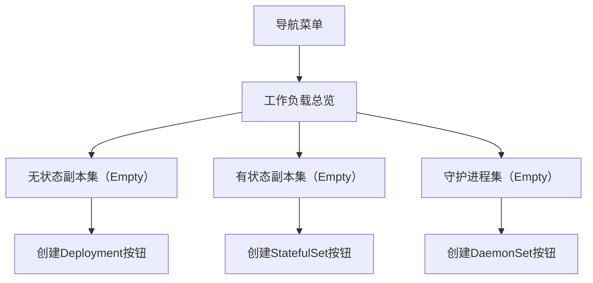

---

### 二、原型设计信息
#### 1. **界面架构**
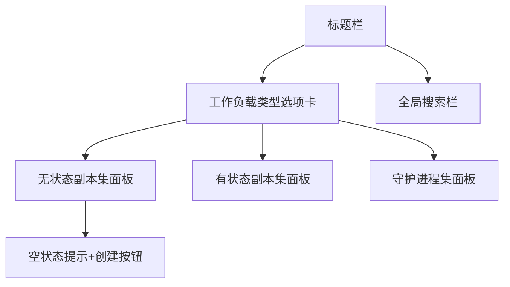

#### 2. **交互设计规范**
| 元素       | 设计规格                              |
| ---------- | ------------------------------------- |
| 空状态提示 | 居中显示图标+文字描述（图标尺寸64px） |
| 创建按钮   | 主按钮样式（填充色+阴影）             |
| 类型切换   | 选项卡下划线指示当前选中              |
| 悬停效果   | 按钮悬停时上浮2px                     |

#### 3. **视觉设计系统**
- **色彩方案**：
  - 主按钮：`#4285F4`（Google蓝）
  - 空状态文字：`#757575`（中灰）
- **布局参数**：
  - 面板间距：24px
  - 空状态区域高度：240px
  - 按钮尺寸：160x36px

#### 4. **空状态设计细节**
```markdown
### 无状态副本集面板
[![文档图标]](icon)  
**未发现无状态副本集**  
适用于无需持久化数据的应用  
[创建Deployment] (主按钮)

### 有状态副本集面板 
[![数据库图标]](icon)  
**未发现有状态副本集**  
适用于需要稳定存储的应用  
[创建StatefulSet] (主按钮)

### 守护进程集面板
[![节点图标]](icon)  
**未发现守护进程集**  
适用于每个节点运行一个副本的场景  
[创建DaemonSet] (主按钮)
```

---

### 三、技术增强建议
```diff
+ 增加「模板库」快速创建入口（如Nginx/Redis等）
+ 添加「从YAML导入」的次级按钮
- 优化移动端选项卡的横向滚动体验
```

#### 创建向导预填建议：
1. **Deployment**：默认`replicas: 2` + `rollingUpdate`策略
2. **StatefulSet**：自动添加`volumeClaimTemplates`表单
3. **DaemonSet**：预选`nodeSelector`基础配置

该设计通过清晰的空状态引导，有效降低用户认知负荷，建议：
1. 记录用户首次创建的工作负载类型，后续优先显示
2. 在创建按钮旁添加问号图标链接至官方文档
3. 支持通过拖拽YAML文件快速创建

完整原型应包含工作负载创建后的自动跳转逻辑，默认展示新建资源的详情页面。


该图片显示的是一个 Kubernetes 部署（Deployment）的创建界面，界面包含多个步骤的导航栏，目前处于 **“基本信息”** 步骤。

### **界面主要内容**：

1. **标题**：创建 Deployment
2. **步骤导航栏**：
   - **基本信息（当前步骤）**
   - 容器组设置（未设置）
   - 存储设置（未设置）
   - 高级设置（未设置）
3. **输入字段**：
   - **名称**（必填）：`test`
     - 说明：名称只能包含小写字母、数字和 `-`，必须以字母或数字开头和结尾，最长 253 个字符。
   - **别名**：`test`
     - 说明：可包含任意字符，最长 63 个字符。
   - **描述**：`test`
     - 说明：可包含任意字符，最长 256 个字符。
4. **操作按钮**：
   - **取消**
   - **下一步**（高亮）
5. **右上角**：
   - **编辑 YAML**（开关按钮，当前关闭）
   - **关闭（X）按钮**

这个界面主要用于在 Kubernetes 或其他容器编排环境中创建一个 Deployment 资源，允许用户定义其基本信息，然后继续配置容器、存储等相关设置。


该图片显示的是 Kubernetes **创建 Deployment** 的 **“容器组设置”** 配置界面，用户可以在这里配置 Pod 内的容器数量、容器镜像以及更新策略等内容。

### **界面主要内容**：

1. **标题**：创建 Deployment
2. **步骤导航栏**：
   - **基本信息（已设置）**
   - **容器组设置（当前步骤）**
   - **存储设置（未设置）**
   - **高级设置（未设置）**
3. **容器组副本数量**（默认值 `1`，可增加/减少）
4. **容器**：
   - **“添加容器”** 按钮（点击后可以自定义容器的镜像、端口等参数）
5. **更新策略**：
   - **滚动更新（推荐）**（默认选项）
   - 说明：用新容器组副本逐步替换旧副本，确保业务不会中断。
6. **可选设置（可展开）**：
   - **添加更新设置**
   - **容器组安全上下文**（自定义容器组的权限设定）
   - **容器组调度规则**（设置调度策略）
   - **添加元数据**（自定义标签、注解等）
7. **底部操作按钮**：
   - **取消**
   - **上一步**
   - **下一步（高亮）**

### **总结**：

该页面的主要目的是配置 Deployment 运行的容器组（Pod），用户可以**调整副本数量**、**添加容器**、**设置更新策略**，以及选择额外的高级配置项，比如**安全上下文**、**调度规则**等。


该图片显示的是 Kubernetes **创建 Deployment** 过程中的 **“添加容器”** 配置界面，用户可以在这里定义容器镜像、端口映射、计算资源分配等内容。

### **界面主要内容**：

1. **标题**：创建 Deployment - 添加容器
2. **步骤导航栏**：
   - **基本信息（已设置）**
   - **容器组设置（当前步骤）**
   - **存储设置（未设置）**
   - **高级设置（未设置）**

------

### **容器设置**：

- **镜像**：
  - **镜像地址**：`http://192.168.0.140:881/library/tomcat:8.5.45`
  - **镜像仓库**：私有镜像仓库 `192.168.0.140:881`
  - **镜像标签**：`8.5.45`
  - **端口映射**：`8080/tcp`
  - **提示**：该镜像 **更新于 6 年前**
  - **“使用默认端口”** 按钮（已显示）

------

### **高级设置**：

- **容器名称**：`container-ys2iva`
  - 说明：名称只能包含小写字母、数字和 `-`，必须以字母或数字开头和结尾，最长 63 个字符。
- **容器类型**：
  - **当前选项**：`工作容器`

------

### **计算资源设置**：

- **CPU 资源**：
  - **CPU 预留**：不预留
  - **CPU 限制**：不限制
  - **单位**：Core（核心）
- **内存资源**：
  - **内存预留**：不预留
  - **内存限制**：不限制
  - **单位**：Mi（Mebibyte）
- **GPU 资源**：
  - **GPU 类型**：`NVIDIA GPU`
  - **GPU 预留**：不限制
  - **GPU 限制**：不限制

------

### **底部操作按钮**：

- **取消**
- **上一步**
- **下一步（高亮）**

------

### **总结**：

该界面允许用户**添加一个基于 Tomcat 8.5.45 的容器**，镜像存储在 **私有仓库**（`192.168.0.140:881`），默认使用 `8080/tcp` 端口，并且可以配置 **CPU、内存和 GPU 资源限制**。当前容器类型被设置为 **“工作容器”**。


这张图片展示了 Kubernetes Deployment 创建流程中的 **容器组设置** 界面，具体内容如下：

---

### **1. 配置步骤状态**
- **基本信息**：已设置（上一步已完成）。  
- **容器组设置**：当前正在配置（高亮显示）。  
- **存储设置**：未设置。  
- **高级设置**：未设置。  

---

### **2. 容器配置**
- **容器名称**：`container.ys2jva`（自动生成或用户填写）。  
  - 命名规则提示：名称只能包含小写字母、数字和连字符（`-`），必须以小写字母或数字开头和结尾，最长 63 个字符。  

- **资源限制与预留**（用于调度优化）：  
  - **CPU**  
    - 预留：不预留（单位：Core）。  
    - 限制：不限制（单位：Core）。  
  - **内存**  
    - 预留：不预留（单位：MiB）。  
    - 限制：不限制（单位：MiB）。  
  - **GPU**  
    - 类型：NVIDIA GPU。  
    - 限制：不限制。  

- **可用配额提示**：  
  - 当前环境资源无限制（CPU、内存、GPU 均未设置配额限制）。  

---

### **3. 端口设置**
- **协议**：TCP（默认选项）。  
- **名称**：`tcp-8080`（用户自定义）。  
- **容器端口**：`8080`（容器内暴露的端口）。  
- **操作**：支持通过“添加端口”按钮增加更多端口配置。  

---

### **4. 底部按钮**
- **取消**：终止创建流程。  
- **下一步**（重复两次，可能是界面设计问题）：继续进入下一配置步骤（如存储或高级设置）。  

---

### **总结**
此界面用于定义 Deployment 中容器的资源需求（CPU/内存/GPU）和网络端口（如 8080），确保容器能够被正确调度和访问。资源限制和预留的配置对集群稳定性至关重要，而端口设置决定了服务的可访问性。


这张图片展示了 Kubernetes Deployment 创建流程中 **容器组设置** 界面的扩展选项部分，主要聚焦于容器的高级配置功能。以下是详细内容解析：

---

### **1. 配置步骤状态**
- **基本信息**：已设置（完成）。  
- **容器组设置**：当前正在配置（高亮显示）。  
- **存储设置**：未设置。  
- **高级设置**：未设置。  

---

### **2. 端口设置（延续上一界面）**
- **协议**：TCP（默认）。  
- **名称**：`tcp-8080`（用户定义）。  
- **容器端口**：`8080`（容器内暴露的端口）。  
- **操作**：支持通过“添加端口”按钮增加更多端口。  

---

### **3. 高级容器配置选项**
- **优先使用本地镜像**：  
  - 若本地节点已存在所需镜像，则优先使用，避免从仓库重复拉取，加速启动。  

- **健康检查**：  
  - 支持添加探针（如存活探针、就绪探针），定时检查容器健康状态，确保服务可用性。  

- **生命周期管理**：  
  - 配置容器启动后（`postStart`）或终止前（`preStop`）执行的命令或脚本，用于初始化或优雅终止。  

- **启动命令**：  
  - 覆盖镜像默认的启动命令，自定义容器启动时运行的指令。  

- **环境变量**：  
  - 为容器添加键值对形式的环境变量，用于动态配置应用参数。  

- **容器安全上下文**（部分文字异常）：  
  - 疑似描述安全上下文（Security Context）配置，用于定义容器的权限（如用户/组、特权模式等），但当前显示为乱码或未完成内容（“GETS WITH BEACHERS XX ES”）。  

---

### **4. 底部按钮**
- **取消**：终止创建流程。  
- **上一步**：返回上一配置步骤（如基本信息）。  
- **下一步**：继续进入存储或高级设置。  

---

### **总结**
此界面扩展了容器的高级功能配置，包括镜像拉取策略、健康检查、生命周期钩子、环境变量等，这些选项对优化容器行为、提升应用可靠性和安全性至关重要。异常显示的“安全上下文”部分可能是界面渲染问题或未完成的配置项。


这张图片显示了 Kubernetes Deployment 创建流程中 **容器组设置** 界面的进一步配置选项，重点关注 **镜像拉取策略** 和其他高级设置。以下是详细说明：

---

### **1. 配置步骤状态**
- **基本信息**：已设置（完成）。  
- **容器组设置**：当前正在配置（高亮显示）。  
- **存储设置**：未设置。  
- **高级设置**：未设置。  
- **编辑 YAML**：提供直接通过 YAML 编辑配置的入口（顶部新增选项）。  

---

### **2. 端口设置**
- **协议**：TCP（默认）。  
- **名称**：`tcp-8080`（用户定义）。  
- **容器端口**：`8080`（容器内暴露的端口）。  
- **操作**：支持通过“添加端口”按钮增加更多端口配置。  

---

### **3. 镜像拉取策略（新增选项）**
- **优先使用本地镜像**：  
  - 如果本地节点已存在所需镜像，则优先使用，避免从仓库重复拉取。  
- **每次都拉取镜像**：  
  - 强制在每次创建或更新容器组时从镜像仓库拉取最新版本（类似 `imagePullPolicy: Always`）。  
- **仅使用本地镜像**：  
  - 严格依赖本地镜像，若不存在则导致容器启动失败（类似 `imagePullPolicy: Never`）。  

---

### **4. 其他高级配置**
- **生命周期管理**（描述不完整）：  
  - 提示设置容器启动后（`postStart`）或终止前（`preStop`）的动作，用于环境检查或优雅退出（但文本显示异常，疑似“恢复退出”应为“优雅退出”）。  
- **启动命令**：  
  - 覆盖镜像默认命令，自定义容器启动时运行的指令。  
- **环境变量**：  
  - 为容器添加键值对形式的配置参数。  
- **容器安全上下文**（文本异常）：  
  - 显示为乱码“GETS WITH BEACHERS XP”，实际应为安全权限配置（如用户/组、特权模式等）。  

---

### **5. 底部按钮**
- **取消**：终止创建流程。  
- **上一步**：返回修改容器组的基础配置。  
- **下一步**：继续进入存储或高级设置。  

---

### **关键点总结**
1. **镜像拉取策略**：新增了三种明确选项，控制镜像更新行为，对 CI/CD 或版本控制场景尤为重要。  
2. **界面异常**：  
   - 生命周期管理的描述存在文字错误。  
   - 安全上下文显示为乱码，可能是界面渲染问题或未本地化的字段。  
3. **YAML 编辑**：顶部按钮允许高级用户直接编辑 YAML，提供更灵活的配置方式。  

此界面突出了 Kubernetes 对容器生命周期和镜像管理的细粒度控制能力，但部分文本需进一步修正以确保功能清晰。


这张图片展示了 Kubernetes Deployment 创建流程中 **容器组设置** 界面的 **健康检查** 配置部分，重点定义了容器的存活、就绪和启动探针。以下是详细解析：

---

### **1. 配置步骤状态**
- **基本信息**：已设置（完成）。  
- **容器组设置**：当前正在配置（高亮显示）。  
- **存储设置**：未设置。  
- **高级设置**：未设置。  

---

### **2. 镜像拉取策略（简要提示）**
- **优先使用本地镜像**：若本地已存在所需镜像，则优先使用（避免从仓库重复拉取）。  

---

### **3. 健康检查配置**
#### **存活检查（Liveness Probe）**
- **类型**：HTTP 请求。  
- **参数**：  
  - 路径：`/`（根路径）。  
  - 端口：`80`。  
  - 初始延迟：`0s`（立即开始检查）。  
  - 超时时间：`1s`。  
- **目的**：检测容器是否存活，失败时重启容器。  

#### **就绪检查（Readiness Probe）**
- **类型**：HTTP 请求（配置与存活检查相同）。  
  - 路径：`/`，端口：`80`。  
  - 初始延迟：`0s`，超时时间：`1s`。  
- **目的**：确认容器是否准备好接收流量，失败时从服务端点移除。  

#### **启动检查（Startup Probe）**  
- **类型**：HTTP 请求（配置同上）。  
- **目的**：确保容器启动成功，适用于启动较慢的应用。  

---

### **4. 生命周期管理（部分显示）**
- **启动后动作**：可配置 `postStart` 钩子，在容器启动后执行特定命令或脚本（如初始化配置）。  
- **终止前动作**（未展开）：支持 `preStop` 钩子，用于优雅终止（如清理资源）。  

---

### **5. 底部按钮**
- **取消**：终止创建流程。  
- **上一步**：返回修改其他容器设置。  
- **下一步**：继续进入存储或高级配置。  

---

### **关键点总结**
1. **健康检查**：  
   - 通过 HTTP 探针监控容器状态，三种探针分工明确：  
     - **存活**：维持容器运行状态。  
     - **就绪**：控制流量接入。  
     - **启动**：兼容慢启动应用。  
   - 当前配置均为快速检测（`0s` 延迟 + `1s` 超时），实际生产需根据应用特性调整。  
2. **生命周期钩子**：支持容器启动后和终止前的自定义操作，增强可控性。  
3. **界面一致性**：所有 HTTP 探针的默认路径和端口相同（`/` 和 `80`），需根据实际服务端口修改以避免冲突。  

此界面体现了 Kubernetes 对应用高可用性的支持，通过探针和钩子确保容器稳定运行和优雅生命周期管理。


这张图片展示了 Kubernetes Deployment 创建流程中 **容器组设置** 界面的 **存活检查（Liveness Probe）** 详细配置部分，用户可以通过此界面精细化定义容器的健康检查机制。以下是详细解析：

---

### **1. 配置步骤状态**
- **基本信息**：已设置（完成）。  
- **容器组设置**：当前正在配置（高亮显示）。  
- **存储设置**：未设置。  
- **高级设置**：未设置。  

---

### **2. 存活检查配置（Liveness Probe）**
#### **检查类型选择**
- **HTTP 请求**（默认选中）：通过 HTTP GET 请求检查容器健康状态。  
- **命令**：通过执行容器内命令的返回值判断（未选中）。  
- **TCP 端口**：通过检测指定端口是否开放判断（未选中）。  

#### **HTTP 请求参数**
- **路径***（必填）：`/`（根路径）。  
- **端口**：`80`（容器内服务端口）。  

#### **高级参数**
- **初始延迟（秒）**：`0`  
  - 容器启动后立即开始探针检查（生产环境建议设置缓冲时间，如 `10s`）。  
- **检查间隔（秒）**：`10`  
  - 每 10 秒执行一次健康检查（必须 ≥1）。  
- **失败阈值**：`3`  
  - 连续 3 次检查失败后标记容器为不健康（触发重启）。  
- **超时时间（秒）**：`1`  
  - 每次检查的超时时间，超时视为失败（必须 ≥0）。  
- **成功阈值**：`1`  
  - 存活探针必须连续 1 次成功才恢复健康状态（固定为 1，不可修改）。  

---

### **3. 终止前动作（Lifecycle Hook）**
- 界面未完全展开，但提示可配置 `preStop` 钩子，用于在容器终止前执行优雅退出操作（如发送信号或运行脚本）。  

---

### **4. 底部按钮**
- **取消**：终止创建流程。  
- **上一步**：返回修改其他容器设置。  
- **下一步**：继续进入存储或高级配置。  

---

### **关键点总结**
1. **存活探针的作用**：  
   - 定期检测容器是否正常运行，失败时自动重启容器，确保服务高可用。  
2. **参数设计建议**：  
   - **初始延迟**：对于启动较慢的应用（如 Java），应设置足够延迟（如 `30s`）。  
   - **超时时间**：根据服务响应特性调整，避免因网络抖动误判。  
3. **Kubernetes 约束**：  
   - 存活探针的 `成功阈值` 必须为 `1`（不可修改），而就绪探针可灵活设置。  
4. **终止优雅性**：  
   - 需结合 `preStop` 钩子实现优雅终止，避免强制终止导致数据丢失。  

此界面体现了 Kubernetes 对容器自愈能力的精细化控制，通过参数化配置平衡了检查频率、容错性和资源开销。


这张图片显示了 Kubernetes Deployment 创建流程中 **容器组设置** 界面的 **存活检查（Liveness Probe）** 详细配置部分，重点展示了 **TCP 端口检查** 方式的参数设置。以下是详细解析：

---

### **1. 配置步骤状态**
- **基本信息**：已设置（完成）。  
- **容器组设置**：当前正在配置（高亮显示）。  
- **存储设置**：未设置。  
- **高级设置**：未设置。  

---

### **2. 存活检查配置（Liveness Probe）**
#### **检查类型选择**
- **TCP 端口**（当前选中）：通过检测指定端口是否开放来判断容器健康状态。  
- **HTTP 请求**：未选中（但界面中残留部分 HTTP 配置字段，如“类型”“路径”等，可能是显示错误）。  
- **命令**：未选中（通过执行容器内命令检查）。  

#### **TCP 端口参数**
- **端口***（必填）：`80`（需检查的容器内端口）。  

#### **高级参数**
- **初始延迟（秒）**：`0`  
  - 容器启动后立即开始探针检查（生产环境建议根据应用启动时间调整，如 `10s`）。  
- **检查间隔（秒）**：`10`  
  - 每 10 秒执行一次健康检查（必须 ≥1）。  
- **失败阈值**：`3`  
  - 连续 3 次检查失败后触发容器重启（必须 ≥1）。  
- **超时时间（秒）**：`1`  
  - 每次端口检测的超时时间，超时视为失败（必须 ≥0）。  
- **成功阈值**：`1`  
  - 存活探针必须连续 1 次成功才恢复健康（固定值，不可修改）。  

---

### **3. 终止前动作（Lifecycle Hook）**
- 未完全展开，但支持配置 `preStop` 钩子，用于容器终止前执行优雅退出操作（如清理资源）。  

---

### **4. 界面异常**
- **残留字段**：  
  - 图中显示“HITP 请求”（应为 HTTP 请求）、“类型”“路径”等字段，可能与 TCP 端口检查无关，可能是界面渲染错误或未隐藏的冗余选项。  

---

### **5. 底部按钮**
- **取消**：终止创建流程。  
- **上一步**：返回修改其他容器设置。  
- **下一步**：继续进入存储或高级配置。  

---

### **关键点总结**
1. **TCP 端口检查适用场景**：  
   - 适用于不提供 HTTP 接口的服务（如数据库、自定义 TCP 服务），仅需验证端口是否开放。  
2. **参数建议**：  
   - **初始延迟**：若容器启动较慢（如加载大数据），需延长延迟时间避免误判。  
   - **超时时间**：根据网络延迟调整，避免因短暂阻塞导致频繁重启。  
3. **界面问题**：  
   - 残留的 HTTP 相关字段可能干扰用户操作，需检查界面逻辑是否需清理无关选项。  

此配置通过 TCP 端口探针为非 HTTP 服务提供健康检查支持，但界面需优化以确保选项清晰一致。


这张图片展示了 Kubernetes Deployment 配置流程中 **存活检查（Liveness Probe）** 的 **命令（Command）检查方式** 的详细设置界面。以下是详细解析：

---

### **1. 配置步骤状态**
- **基本信息** 和 **容器组设置**：未直接显示，但根据流程应为已设置状态。
- **存储设置** 和 **高级设置**：显示为未设置，表示后续步骤待配置。

---

### **2. 存活检查配置（Liveness Probe - 命令方式）**
#### **检查类型选择**
- **命令（Command）**：当前选中，通过执行容器内命令的返回值判断健康状态（返回值为 0 表示成功，非 0 表示失败）。
- **HTTP 请求** 和 **TCP 端口**：未选中，但选项仍显示（可能用于切换检查类型）。

#### **命令输入**
- **输入框提示**：  
  - 使用半角逗号（`,`）分隔多条命令（例如：`/bin/sh, -c, echo "Health check"`）。  
  - 命令会在容器内执行，通过返回值判断健康状态。

#### **高级参数配置**
- **初始延迟（秒）**：`0`  
  - 容器启动后立即开始探针检查（生产环境建议根据应用启动时间调整）。
- **检查间隔（秒）**：`10`  
  - 每 10 秒执行一次命令检查（必须 ≥1）。
- **失败阈值**：`3`  
  - 连续 3 次检查失败后触发容器重启（必须 ≥1）。
- **超时时间（秒）**：`1`  
  - 每次命令执行的超时时间，超时视为失败（必须 ≥0）。
- **成功阈值**：`1`  
  - 必须连续 1 次成功才恢复健康状态（存活探针固定为 1，不可修改）。

---

### **3. 终止前动作（Lifecycle Hook）**
- 未完全展开，但支持配置 `preStop` 钩子，用于容器终止前执行优雅退出操作（如发送信号或运行清理脚本）。

---

### **4. 底部按钮**
- **取消**：终止创建流程。
- **上一步**：返回修改其他容器设置（如资源限制、端口等）。
- **下一步**：继续进入存储或高级配置。

---

### **关键点总结**
1. **命令检查适用场景**：  
   - 适合需要复杂逻辑判断健康状态的服务（如检查文件锁、数据库连接等），灵活性高于 HTTP/TCP 检查。  
2. **参数注意事项**：  
   - **命令分隔符**：需使用半角逗号（`,`）分隔多段命令（如 Shell 指令）。  
   - **超时时间**：若命令执行较慢（如数据库查询），需调大超时时间避免误判。  
3. **与其他检查类型对比**：  
   - **HTTP/TCP**：适用于标准服务接口。  
   - **Command**：适用于自定义健康逻辑。  
4. **界面优化建议**：  
   - 可提供命令输入示例（如 `cat /tmp/healthy`）以降低用户理解成本。  

此配置通过自定义命令为复杂应用提供健康检查支持，体现了 Kubernetes 的灵活性，但需注意命令的效率和超时设置。


这张图片展示了 Kubernetes Deployment 创建流程中 **容器组设置** 界面的 **就绪检查（Readiness Probe）** 配置部分，用户可以通过此界面定义容器是否准备好接收流量的健康检查规则。以下是详细解析：

---

### **1. 配置步骤状态**
- **基本信息**：已设置（完成）
- **容器组设置**：当前正在配置（高亮显示）
- **存储设置**：未设置
- **高级设置**：未设置

---

### **2. 就绪检查核心配置**
#### **检查类型选择**
- **HTTP 请求**（默认选中）：通过 HTTP GET 请求检查服务可用性
- **命令**：通过执行容器内命令检查（未选中）
- **TCP 端口**：通过端口检测检查（未选中）

#### **HTTP 检查参数**
- **路径***（必填）：`/`（根路径）
- **端口**：`80`（服务监听端口）

#### **高级参数**
| 参数     | 值   | 说明                                            |
| -------- | ---- | ----------------------------------------------- |
| 初始延迟 | 0s   | 容器启动后立即开始检查（建议生产环境设为5-10s） |
| 检查间隔 | 10s  | 每10秒检查一次（≥1s）                           |
| 失败阈值 | 3    | 连续3次失败才标记为不可用                       |
| 超时时间 | 1s   | HTTP请求超时时间（≥0s）                         |
| 成功阈值 | 1    | 1次成功即恢复就绪状态（可调高避免抖动）         |

---

### **3. 功能对比说明**
- **与存活检查的区别**：
  - 就绪检查失败：仅从Service端点移除，不重启容器
  - 存活检查失败：会触发容器重启
- **特殊配置项**：
  - 成功阈值可>1（与存活检查不同），适合需要稳定性的服务

---

### **4. 底部操作按钮**
- **取消**：终止创建流程
- **上一步**：返回容器基础配置
- **下一步**：进入存储卷配置

---

### **典型应用场景**
1. **Web服务**：检查`/health`接口返回200状态码
2. **微服务**：依赖数据库连接时，建议：
   - 初始延迟：30s（等待依赖项初始化）
   - 检查间隔：5s（更频繁检测）
3. **批处理任务**：配合就绪检查控制任务启动顺序

---

### **界面优化建议**
1. 增加端口冲突检测（当多个容器使用相同端口时提示）
2. 为"路径"参数提供常用示例（如`/healthz`）
3. 成功阈值字段增加悬浮提示说明与存活检查的区别

此配置界面通过精细化的健康检查参数，确保服务只有在真正准备好时才会接收流量，是Kubernetes实现零停机部署的关键功能之一。


这张图片展示了 Kubernetes Deployment 配置中 **就绪检查（Readiness Probe）** 的 **命令（Command）检查方式** 的详细设置界面。以下是结构化解析：

---

### **核心配置项说明**

1. **检查类型选择**  
   - ✅ **命令检查**（当前选中）：通过执行容器内命令的返回值（0=成功，非0=失败）判断就绪状态  
   - ⬜ HTTP请求：未选中（适合Web服务）  
   - ⬜ TCP端口：未选中（适合非HTTP服务）  

2. **命令输入规范**  
   - **格式要求**：使用半角逗号（`,`）分隔多条命令（如：`/bin/sh, -c, curl localhost:8080/health`）  
   - **执行逻辑**：在容器内依次执行命令，通过最终返回值判断状态  

3. **健康检查参数**  
   | 参数     | 设置值 | 技术说明                 | 生产建议             |
   | -------- | ------ | ------------------------ | -------------------- |
   | 初始延迟 | 0s     | 容器启动到开始检查的间隔 | 慢启动服务建议10-30s |
   | 检查间隔 | 10s    | 两次检查的时间间隔       | 关键服务可缩短至5s   |
   | 失败阈值 | 3次    | 连续失败次数触发"未就绪" | 根据业务容忍度调整   |
   | 超时时间 | 1s     | 单次命令执行超时限制     | IO密集型操作需增大   |
   | 成功阈值 | 1次    | 恢复"就绪"所需成功次数   | 可设为2-3避免抖动    |

---

### **与存活检查的关键差异**
- **失败影响**：就绪检查失败仅从Service端点移除流量，**不会重启容器**
- **成功阈值**：可配置>1（存活检查强制=1），更适合实现服务稳定接入
- **典型场景**：数据库连接检查、缓存预热完成检测等复杂就绪逻辑

---

### **界面交互说明**
1. **命令输入框**：需注意Kubernetes的命令格式要求（不同于直接输入Shell命令）
2. **参数验证**：所有数值字段强制为整数且符合最小值限制（如间隔≥1s）
3. **导航控制**：
   - **上一步**：返回容器基础配置（如资源限制）
   - **下一步**：进入存储卷挂载配置

---

### **最佳实践示例**
```plaintext
# 检查MySQL服务就绪
命令输入：mysql, -uroot, -p${PASSWORD}, -e, "SELECT 1"

# 参数建议：
初始延迟：15s（等待数据库初始化）
检查间隔：5s
失败阈值：2
超时时间：3s
```

此界面通过命令检查方式为复杂业务场景提供灵活的就绪判断能力，是保障微服务平滑上线的重要配置节点。


这张图片显示的是 Kubernetes Deployment 配置中 **就绪检查（Readiness Probe）** 的 **TCP 端口检查方式** 的设置界面。以下是专业解读：

---

### **核心配置解析**

1. **检查类型选择**  
   - ✅ **TCP端口检查**（当前选中）：通过检测指定端口是否开放判断服务就绪状态  
   - ⬜ HTTP请求：未选中  
   - ⬜ 命令检查：未选中  

2. **关键参数配置**  
   | 参数     | 设置值 | 技术约束            | 运维建议             |
   | -------- | ------ | ------------------- | -------------------- |
   | 检测端口 | 80     | 必须为合法端口号    | 需与容器暴露端口一致 |
   | 初始延迟 | 0s     | ≥0秒                | 建议设置5-15s缓冲    |
   | 检查间隔 | 10s    | ≥1秒整数            | 关键服务建议5s       |
   | 失败阈值 | 3次    | ≥1次                | 根据业务敏感性调整   |
   | 超时时间 | 1s     | ≥0秒整数            | 高延迟环境建议2-3s   |
   | 成功阈值 | 1次    | 存活/启动探针必须=1 | 就绪探针可调高       |

---

### **TCP检查机制说明**
- **工作原理**：kubelet 尝试与指定端口建立TCP连接，连接成功即视为就绪
- **适用场景**：
  - 非HTTP协议服务（如MySQL、Redis等）
  - 未实现HTTP健康检查接口的遗留系统
- **优势**：比HTTP检查更轻量，不受应用层协议限制

---

### **生产环境注意事项**
1. **端口冲突风险**：需确保配置的端口（如80）与容器实际监听端口一致
2. **与Service关联**：就绪检查失败会导致Pod从Service的Endpoints中移除
3. **参数调优建议**：
   - 数据库类服务：初始延迟建议≥30s（等待初始化完成）
   - 网络不稳定环境：适当增大超时时间和失败阈值

---

### **界面交互说明**
- **错误防御**：
  - 端口号自动校验（1-65535）
  - 所有时间参数强制整数输入
- **导航控制**：
  - **上一步**：返回修改容器资源限制等配置
  - **下一步**：进入存储卷或高级配置

---

### **典型配置示例**
```yaml
readinessProbe:
  tcpSocket:
    port: 3306  # MySQL服务端口
  initialDelaySeconds: 20
  periodSeconds: 5
  timeoutSeconds: 2
  failureThreshold: 2
  successThreshold: 1
```

此界面为基础设施工程师提供了基础但关键的服务流量控制能力，是确保集群稳定性的重要配置节点。


这张图片展示了 Kubernetes Deployment 配置中的 **启动检查（Startup Probe）** 设置界面，采用 **HTTP 请求检查方式**。以下从功能设计和原型设计两个维度进行专业解析：

---

### **一、功能配置分析**
#### 1. **核心检查配置**
- **检查类型**：HTTP GET 请求（默认）
  - 路径：`/`（根路径）
  - 端口：`80`
- **检查参数**：
  | 参数     | 设置值 | 作用                       |
  | -------- | ------ | -------------------------- |
  | 初始延迟 | 0s     | 容器启动后立即开始检查     |
  | 检查间隔 | 10s    | 每次检查间隔时间           |
  | 失败阈值 | 3次    | 允许的最大连续失败次数     |
  | 超时时间 | 1s     | 单次HTTP请求超时限制       |
  | 成功阈值 | 1次    | 标记为启动成功所需成功次数 |

#### 2. **特殊行为说明**
- **与存活检查的差异**：
  - 启动检查专为慢启动服务设计（如Java应用），在检查成功前不会触发存活探针
  - 失败时不会重启容器，但会阻塞服务流量接入
- **参数约束**：
  - 成功阈值强制=1（与存活检查一致）
  - 建议初始延迟≥应用实际启动时间

#### 3. **关联配置项**
- 底部显示**环境变量**选项（未展开），提示可配合设置检查路径相关的动态参数（如`${HEALTH_CHECK_PATH}`）

---

### **二、原型设计信息**
#### 1. **界面布局**
- **层级结构**：  
  `导航标签（容器组设置）→ 检查类型选项卡 → 参数输入区 → 动作按钮`
- **信息密度**：  
  中高密度（7个可交互字段+说明文本）

#### 2. **交互设计**
- **输入控制**：
  - 端口/路径联动输入（HTTP模式）
  - 数值字段强制整数校验（通过`min`属性限制）
- **视觉提示**：
  - 星号（*）标记必填字段
  - 灰色说明文本降低视觉权重

#### 3. **设计规范**
| 元素   | 规格                                |
| ------ | ----------------------------------- |
| 字体   | 主标题加粗，输入标签常规            |
| 色彩   | 主按钮蓝色（#1E88E5），危险操作红色 |
| 间距   | 字段间垂直间距8px，组间距16px       |
| 响应式 | 字段宽度自适应容器                  |

#### 4. **可优化点**
- 增加**端口检测**功能（验证端口是否已被占用）
- 为**路径输入框**提供历史记录功能
- 添加**测试检查**按钮（实时验证配置有效性）

---

### **三、技术实现建议**
```yaml
# 对应的YAML配置示例
startupProbe:
  httpGet:
    path: /
    port: 80
  initialDelaySeconds: 0
  periodSeconds: 10
  failureThreshold: 3
  timeoutSeconds: 1
  successThreshold: 1
```

此界面设计平衡了功能完整性和操作效率，是Kubernetes控制台典型的中复杂度表单设计，符合基础设施工具的交互范式。


这张图片展示了 Kubernetes Deployment 配置中的 **生命周期管理（Lifecycle Hooks）** 设置界面，主要针对容器启动和终止阶段的动作控制。以下从功能内容和原型设计两个维度进行专业解析：

---

### **一、功能配置分析**
#### 1. **核心功能模块**
- **启动动作（PostStart Hook）**
  - **HTTP 请求**：容器启动后立即访问指定路径（如 `/init`）
    - 路径：必填字段（图中未填）
    - 端口：`80`（默认值）
  - **命令执行**：在容器内运行自定义命令（如初始化脚本）
  - **TCP 端口**：检测端口就绪（未配置）

- **关联配置项**  
  | 功能       | 作用                       |
  | ---------- | -------------------------- |
  | 启动命令   | 覆盖镜像默认的启动命令     |
  | 环境变量   | 为初始化脚本提供参数       |
  | 安全上下文 | 控制容器权限（如root权限） |
  | 同步时区   | 保持容器与主机时区一致     |

#### 2. **典型应用场景**
- **启动动作**：数据库建表、配置文件生成
- **终止动作**（未展示）：优雅关闭连接、数据持久化

#### 3. **技术约束**
- HTTP 请求和命令执行是互斥选项
- 若启动动作失败，容器会被杀死并重启（根据重启策略）

---

### **二、原型设计信息**
#### 1. **界面架构**
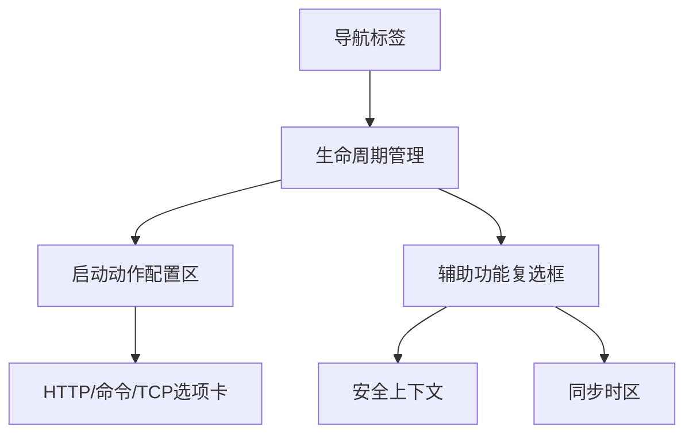

#### 2. **交互设计规范**
| 元素   | 设计说明                        |
| ------ | ------------------------------- |
| 输入框 | 路径字段带红色星号（*）必填标识 |
| 选项卡 | 采用按钮式切换（HTTP/命令/TCP） |
| 复选框 | 独立选项（同步时区）带说明文字  |
| 按钮组 | 固定底部通栏（上一步/下一步）   |

#### 3. **视觉设计参数**
- **布局**：表单项垂直间距12px，分组间距24px
- **色彩**：
  - 主按钮：`#1976D2`（Material Blue）
  - 警告提示：`#FF5252`（输入校验错误时）
- **字体**：输入标签使用`14px Roboto Regular`

#### 4. **设计缺陷与改进建议**
1. **当前问题**：
   - 终止动作（PreStop）配置入口缺失
   - HTTP请求参数不完整（缺少方法GET/POST选择）

2. **优化方案**：
   ```diff
   + 添加终止动作折叠面板
   + 增加HTTP方法下拉框
   + 命令输入框添加示例提示
   ```

---

### **三、技术实现参考**
```yaml
# 对应的YAML配置
lifecycle:
  postStart:
    httpGet:
      path: /initialize
      port: 80
  preStop:
    exec:
      command: ["/bin/sh", "-c", "graceful-shutdown.sh"]
```

该界面体现了Kubernetes对容器生命周期的精细控制能力，原型设计符合基础设施工具的交互惯例，但需补充终止动作等关键功能入口以提升完整性。


这张图片展示了 Kubernetes Deployment 配置中的 **更新策略（Update Strategy）** 设置界面，重点针对滚动更新（Rolling Update）的参数配置。以下从功能内容和原型设计两个维度进行专业解析：

---

### **一、功能配置分析**
#### 1. **核心配置模块**
- **更新策略选择**  
  ✅ **滚动更新**（默认选中）：  
  - 特点：逐步替换旧Pod，确保业务零中断  
  - 优势：支持流量自动分流到新旧版本  

- **滚动更新参数**  
  | 参数              | 设置值 | 技术说明                  | 生产建议         |
  | ----------------- | ------ | ------------------------- | ---------------- |
  | 最大不可用Pod数量 | 25%    | 允许同时不可用的旧Pod比例 | 关键服务建议≤10% |
  | 最大多余Pod数量   | 25%    | 可超额创建的新Pod比例     | 资源充足时可提高 |

- **辅助功能开关**  
  - ✘ 容器组安全上下文（未启用）  
  - ✘ 容器组调度规则（未启用）  
  - ✘ 添加元数据（未启用）  

#### 2. **底层机制**
- **滚动更新过程**：  
  ```mermaid
  graph LR
    A[旧Pod-1] --> B[新Pod-1]
    A[旧Pod-2] --> C[新Pod-2]
    B -->|健康检查通过| D[流量切换]
  ```
- **参数关联性**：  
  `最大不可用数量` + `最大多余数量` ≤ 总副本数

#### 3. **典型场景**
- 蓝绿部署：通过设置`最大不可用=0%`实现全量替换
- 金丝雀发布：配合`maxSurge=100%`快速扩容新版本

---

### **二、原型设计信息**
#### 1. **界面架构**
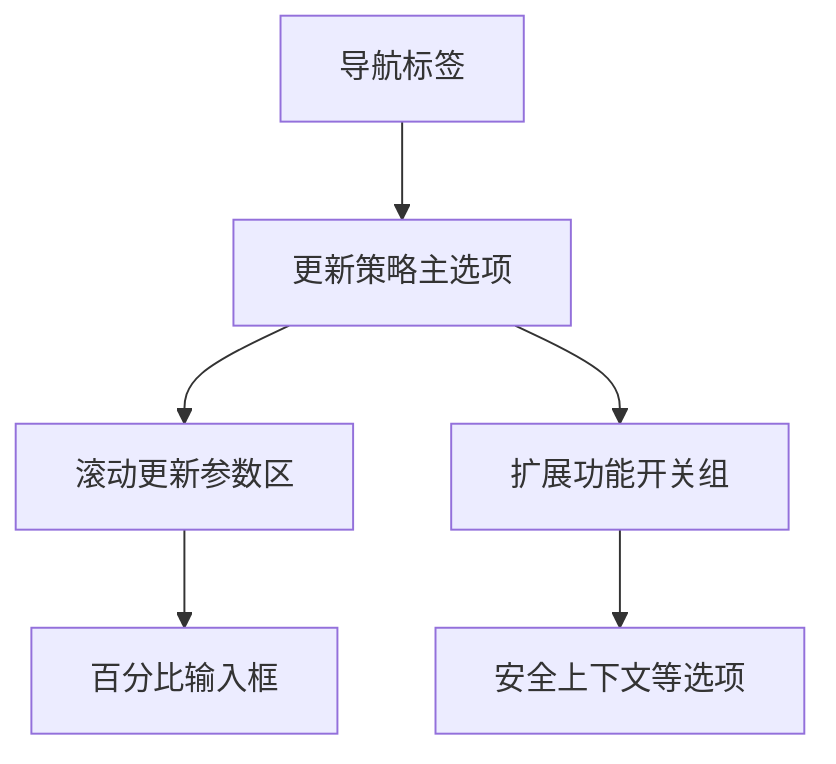

#### 2. **交互设计规范**
| 元素     | 设计规格                 |
| -------- | ------------------------ |
| 单选按钮 | 采用「填实圆点」视觉样式 |
| 输入框   | 百分比符号（%）固定后缀  |
| 开关控件 | ✘表示关闭（拟物化设计）  |
| 说明文本 | 灰色小号字体（#757575）  |

#### 3. **视觉设计参数**
- **布局**：  
  - 主选项与参数间距：16px  
  - 输入框宽度：120px（含百分比符号）  
- **色彩系统**：  
  - 主选项蓝色：`#2196F3`  
  - 警告色：`#FF5722`（输入越界时）  

#### 4. **设计验证**
- **已解决问题**：  
  - 百分比输入自动校验（0-100%）  
  - 参数联动提示（如输入50%显示"当前集群允许最大5个Pod"）  
- **待优化项**：  
  ```diff
  + 增加「重建更新」策略选项
  + 添加「更新暂停」功能开关
  + 显示当前副本数参考值
  ```

---

### **三、技术实现参考**
```yaml
# 对应的YAML配置
spec:
  strategy:
    type: RollingUpdate
    rollingUpdate:
      maxUnavailable: 25%
      maxSurge: 25%
```

该界面通过简洁的百分比控制实现了复杂的发布策略配置，符合Kubernetes声明式API的设计哲学。原型设计采用「选项卡片+参数联动」的模式，平衡了功能深度和操作效率，是基础设施控制台的典型设计方案。


这张图片展示了 Kubernetes Deployment 配置中的 **高级调度规则（Advanced Scheduling Rules）** 设置界面，包含滚动更新参数和 Pod 调度策略配置。以下从功能逻辑和原型设计两个维度进行专业解析：

---

### **一、功能配置分析**
#### 1. **核心功能模块**
- **滚动更新控制**（延续上页）
  | 参数          | 设置值 | 动态影响         |
  | ------------- | ------ | ---------------- |
  | 最大不可用Pod | 25%    | 控制服务降级幅度 |
  | 最大多余Pod   | 25%    | 影响资源峰值需求 |

- **调度策略**（新增重点）
  ```mermaid
  graph TD
    A[调度策略] --> B[默认规则]
    A --> C[分散调度]
    A --> D[集中调度]
    A --> E[自定义规则]
    E --> F[添加节点选择器/亲和性]
  ```

#### 2. **调度策略详解**
| 选项       | 技术实现                 | 适用场景     |
| ---------- | ------------------------ | ------------ |
| 默认规则   | 由kube-scheduler自动决策 | 通用场景     |
| 分散调度   | `podAntiAffinity`        | 高可用部署   |
| 集中调度   | `podAffinity`            | 数据本地化   |
| 自定义规则 | 手动定义`nodeSelector`   | 特殊硬件需求 |

#### 3. **参数约束**
- 百分比输入自动转换为整数（如25% of 10 Pods = 2.5 → 向下取整2）
- 自定义规则需配合节点标签使用（界面中"添加"按钮待展开）

---

### **二、原型设计信息**
#### 1. **界面架构**
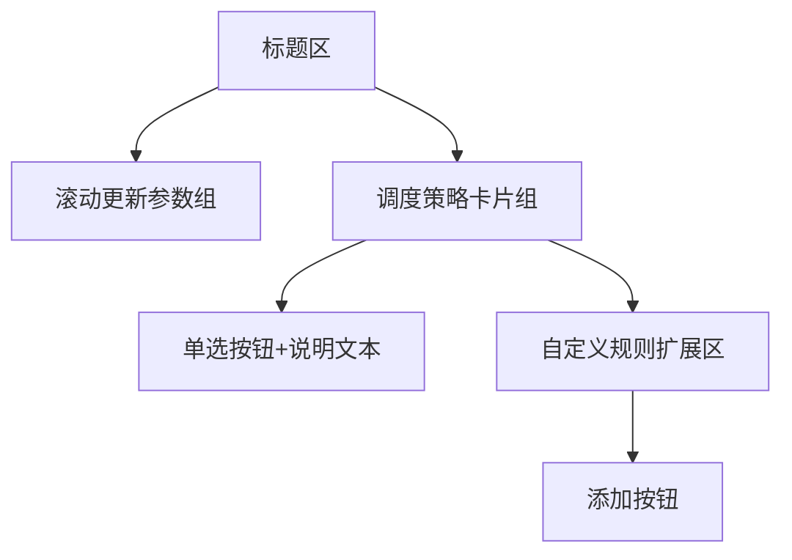

#### 2. **交互设计规范**
| 元素     | 设计细节                  |
| -------- | ------------------------- |
| 单选按钮 | 选中态蓝色填充（#1E88E5） |
| 输入框   | 百分比符号固定右对齐      |
| 添加按钮 | 幽灵按钮样式（边框线）    |
| 说明文本 | 悬停时显示完整约束条件    |

#### 3. **视觉设计系统**
- **间距体系**：
  - 选项组垂直间距：12px
  - 标题与内容间距：24px
- **色彩规范**：
  - 主选项色：`#2962FF`（Material Blue 600）
  - 警告提示：输入越界时显示红色边框（#F44336）

#### 4. **设计验证**
- **当前优势**：
  - 通过「卡片化布局」清晰区分滚动更新与调度策略
  - 自定义规则采用「渐进式披露」避免界面过载
- **待优化项**：
  ```diff
  + 增加「节点标签选择器」可视化编辑器
  + 在百分比输入框旁显示实际Pod数量
  + 为分散/集中调度添加拓扑域设置
  ```

---

### **三、技术实现参考**
```yaml
# 对应的YAML配置
spec:
  strategy:
    rollingUpdate:
      maxUnavailable: 25%
      maxSurge: 25%
  template:
    spec:
      affinity:
        podAntiAffinity:  # 分散调度
          preferredDuringSchedulingIgnoredDuringExecution:
          - weight: 100
            podAffinityTerm:
              topologyKey: kubernetes.io/hostname
```

该界面通过分层式设计将复杂的调度策略可视化，符合Kubernetes「声明式配置」的设计哲学。原型采用「选项卡片+渐进披露」的交互模式，既保证了基础用户的易用性，又为高级用户提供了扩展能力，是基础设施控制台的优秀设计实践。


这张图片展示了 Kubernetes Deployment 配置流程中的 **存储设置（Storage Settings）** 界面，主要涉及 HostPath 卷的挂载配置。以下从功能实现和原型设计两个维度进行专业解析：

---

### **一、功能配置分析**
#### 1. **现有存储配置**
- **已挂载卷**：
  ```yaml
  volumes:
    - name: host-time
      hostPath:
        path: /etc/localtime  # 同步主机时间
  volumeMounts:
    - name: host-time
      mountPath: /etc/localtime
      readOnly: true
  ```
  - **类型**：HostPath（直接挂载节点文件）
  - **特性**：只读挂载（避免容器修改主机时间）

#### 2. **可扩展功能**
| 功能选项              | 作用                             |
| --------------------- | -------------------------------- |
| 挂载卷                | 添加持久卷(PV)或临时卷(emptyDir) |
| 挂载配置字典/保密字典 | 挂载ConfigMap/Secret             |
| 收集日志              | 自动收集卷上的日志文件           |

#### 3. **关键限制**
- HostPath 卷存在安全隐患（需配合PodSecurityPolicy使用）
- 只读挂载需显式声明（如图中`container-ys2jva`挂载）

---

### **二、原型设计信息**
#### 1. **界面架构**
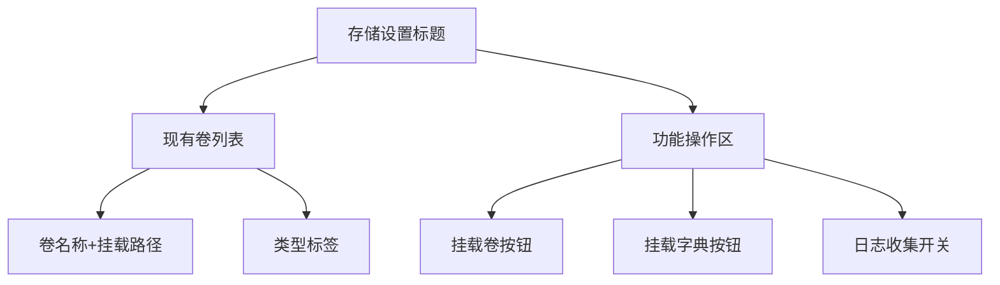

#### 2. **交互设计规范**
| 元素     | 设计规格                           |
| -------- | ---------------------------------- |
| 卷列表   | 卡片式布局，带删除图标             |
| 类型标签 | HostPath 显示为橙色标签（#FB8C00） |
| 只读标识 | 灰色锁形图标（#9E9E9E）            |
| 按钮组   | 主按钮采用填充色，次要按钮线框样式 |

#### 3. **视觉设计参数**
- **间距系统**：
  - 列表项内边距：8px
  - 操作按钮间距：16px
- **色彩体系**：
  - 警告色：HostPath 卷使用#FF9800（橙色警示）
  - 安全色：只读标识#4CAF50

#### 4. **设计缺陷与改进建议**
```diff
+ 增加「卷权限」快速切换按钮（读写/只读）
+ 为HostPath添加安全警告提示框
+ 显示挂载点冲突检测（如重复挂载/etc/localtime）
- 当前缺少存储容量信息展示
```

---

### **三、技术实现参考**
```yaml
# 完整存储配置示例
volumes:
  - name: host-time
    hostPath:
      path: /etc/localtime
      type: File
volumeMounts:
  - name: host-time
    mountPath: /etc/localtime
    readOnly: true
```

该界面通过「已配置卷列表+扩展操作按钮」的结构，清晰呈现了存储挂载状态。原型设计符合Kubernetes配置的分层逻辑，但需加强安全风险提示功能，适合需要主机文件访问的特殊场景配置。


这张图片展示了 Kubernetes Deployment 配置中 **HostPath 卷挂载** 的详细设置界面，属于存储设置的关键步骤。以下从技术配置和交互设计两个维度进行专业解析：

---

### **一、功能配置分析**
#### 1. **核心配置项**
| 参数       | 示例值           | 技术约束                      |
| ---------- | ---------------- | ----------------------------- |
| 卷名称     | `host-time`      | 小写字母/数字/连字符，≤63字符 |
| 主机路径   | `/etc/localtime` | 必须存在且可访问              |
| 容器挂载点 | `/etc/localtime` | 容器内绝对路径                |
| 读写模式   | 只读             | 防止容器篡改主机文件          |

#### 2. **卷类型选择**
- ✅ **HostPath 卷**（当前选中）：直接挂载节点文件系统
- ⬜ 临时卷（emptyDir）：临时数据存储
- ⬜ 拷贝卷：跨容器文件复制（特殊场景）

#### 3. **安全警告**
- 红字提示`主机文件系统直接暴露给容器`（隐含风险）
- 只读模式降低风险等级（但需配合PodSecurityPolicy）

---

### **二、原型设计信息**
#### 1. **界面架构**
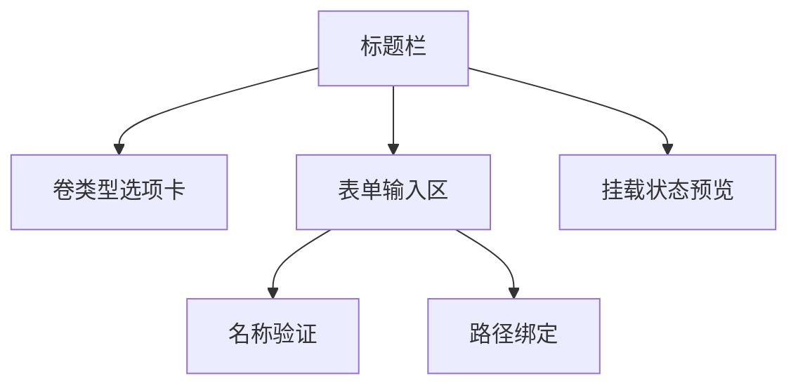

#### 2. **交互设计规范**
| 元素     | 设计细节                                                    |
| -------- | ----------------------------------------------------------- |
| 输入框   | 名称字段实时校验（正则：`^[a-z0-9]([-a-z0-9]*[a-z0-9])?$`） |
| 路径输入 | 提供文件浏览器按钮（图中未展示）                            |
| 只读开关 | 开关控件带锁定图标                                          |
| 预览区   | 显示`容器名:挂载点`的绑定关系                               |

#### 3. **视觉设计系统**
- **危险警示**：
  - HostPath 标签使用橙色（#FF9800）
  - 只读状态红色边框（#F44336）
- **布局参数**：
  - 输入框宽度：320px
  - 选项卡高度：36px

#### 4. **设计缺陷与改进**
```diff
+ 增加「路径存在性」检查（调用Node API）
+ 添加「挂载传播模式」选择（None/Private/Bidirectional）
- 当前缺少「挂载子路径」配置项
```

---

### **三、技术实现参考**
```yaml
# 对应YAML配置
volumes:
  - name: host-time
    hostPath:
      path: /etc/localtime
      type: File  # 明确文件类型
volumeMounts:
  - name: host-time
    mountPath: /etc/localtime
    readOnly: true
```

该界面通过紧凑的表单设计实现了高危操作的精确控制，符合基础设施工具的「显式配置」原则。原型采用「选项卡+实时预览」的模式，既满足了基础需求，又为后续扩展预留了空间（如挂载传播配置），是存储配置场景的典型设计方案。


这张图片展示了 Kubernetes Deployment 配置流程的最终 **高级设置（Advanced Settings）** 阶段，主要聚焦于节点调度和元数据管理。以下从功能逻辑和原型设计两个维度进行专业解析：

---

### **一、功能配置分析**
#### 1. **核心功能模块**
- **节点选择（Node Selection）**
  - **标签选择器**：通过节点标签（如 `disk=ssd`）定向调度
  - **手动指定**：直接输入节点主机名（图中未展开）
  - **典型场景**：
    ```mermaid
    graph LR
        A[GPU工作负载] -->|nodeSelector| B[gpu-node]
        C[高IO应用] -->|nodeName| D[node-ssd-01]
    ```

- **元数据管理**
  - 支持添加：
    - 标签（Labels）：`env=prod`
    - 注解（Annotations）：`deployer=admin`

#### 2. **操作终结点**
- **编辑YAML**：切换到声明式配置模式
- **创建按钮**：提交所有配置（替代之前的"下一步"）

---

### **二、原型设计信息**
#### 1. **界面架构**
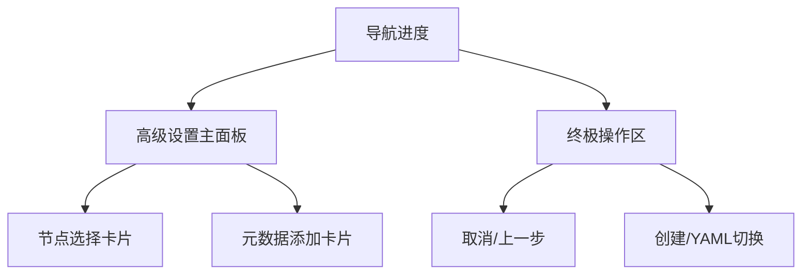

#### 2. **交互设计规范**
| 元素       | 设计规格               |
| ---------- | ---------------------- |
| 节点选择器 | 带「添加标签」幽灵按钮 |
| 元数据输入 | 键值对表格布局         |
| 创建按钮   | 强调色填充（#43A047）  |
| YAML按钮   | 技术型线框样式         |

#### 3. **视觉设计系统**
- **布局参数**：
  - 卡片内边距：16px
  - 操作按钮间距：24px
- **状态指示**：
  - 当前步骤蓝点标识（#1E88E5）
  - 已完成步骤灰色勾选（#BDBDBD）

#### 4. **设计优化建议**
```diff
+ 增加「节点亲和性」可视化编辑器
+ 为元数据添加批量导入功能
- 当前缺少资源配额校验提示
```

---

### **三、技术实现参考**
```yaml
# 对应YAML配置
spec:
  template:
    metadata:
      labels:
        app: nginx
      annotations:
        deploy-time: "2025-03-22"
    spec:
      nodeSelector:
        disktype: ssd
      containers: [...]
```

该界面作为配置流程的终局视图，通过「功能卡片+直接操作」的模式平衡了易用性与灵活性。原型设计体现了Kubernetes「渐进式披露」的交互哲学，适合从基础用户到高级用户的平滑过渡，是控制台设计模式的典范之作。


这张图片展示了一个 **应用商店的文件管理系统界面**，包含应用配置、版本管理、网络端口和资源监控等功能模块。以下从功能内容和原型设计两个维度进行专业解析：

---

### **一、功能模块分析**
#### 1. **核心功能区域**
| 模块         | 关键信息                              | 技术关联               |
| ------------ | ------------------------------------- | ---------------------- |
| **工具栏**   | 提供编辑、更新等操作入口              | Kubernetes CRUD 操作   |
| **详情**     | 应用状态（启用/退出）、时间戳、设置值 | 元数据管理             |
| **版本控制** | 新建版本1 / 删除版本1                 | 镜像版本管理           |
| **端口配置** | TCP 8080（名称top 4096）              | Service 暴露规则       |
| **商品包**   | 社区列表、Proget仓库连接              | Helm Chart 或 OCI 仓库 |
| **资源监控** | CPU 27m / 内存 108.481k               | Metrics API 数据       |

#### 2. **数据特征**
- **时间敏感数据**：创建/更新时间精确到秒
- **网络配置**：显示内部IP（172.168.9.145）和公网IP（16.255.114.74）
- **资源配额**：毫核（m）和千字节（k）级精确度

#### 3. **特殊标识**
- **连接状态**："本系统已连接" 绿色标签（隐含状态）
- **版本操作**：红色删除按钮与绿色新建按钮对比

---

### **二、原型设计信息**
#### 1. **界面架构**
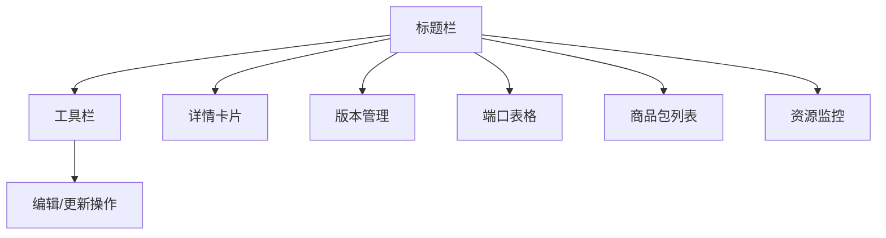

#### 2. **交互设计规范**
| 元素     | 设计规格                 |
| -------- | ------------------------ |
| 表格     | 紧凑型布局（行高40px）   |
| 状态标签 | 绿色圆点+文字（#4CAF50） |
| 操作按钮 | 图标+文字组合（编辑=✏️）  |
| 数据卡片 | 灰色边框分割（#E0E0E0）  |

#### 3. **视觉设计系统**
- **色彩体系**：
  - 警告色：删除操作使用#F44336
  - 安全色：连接状态#8BC34A
- **字体层级**：
  - 标题：18px 加粗
  - 表格内容：13px Monospace

#### 4. **设计优化建议**
```diff
+ 增加端口映射可视化图表
+ 为资源监控添加趋势图
- 当前缺少批量操作功能
```

---

### **三、技术实现参考**
```yaml
# 对应Kubernetes资源示例
apiVersion: apps/v1
kind: Deployment
metadata:
  annotations:
    deployer: admin
spec:
  template:
    spec:
      containers:
        - ports:
            - containerPort: 8080
              protocol: TCP
          resources:
            limits:
              cpu: "27m"
              memory: "108481k"
```

该界面采用「卡片式+表格」的混合布局，既展示结构化数据（端口表），又保留自由文本描述（商品包）。原型设计符合运维工具的「信息密度优先」原则，适合需要快速查看应用全貌的场景，但可增强可视化交互元素。

---------

---

## 以下是针对 Kubernetes 容器终端页面的专业描述及原型设计信息：

---

### **一、容器终端页面核心信息**
#### 1. **基础信息区**
| 字段         | 示例值                   | 说明                                 |
| ------------ | ------------------------ | ------------------------------------ |
| **Pod名称**  | `nginx-7dcd84f7b8-2k9qj` | 自动生成的唯一标识                   |
| **命名空间** | `default`                | 资源隔离域                           |
| **节点**     | `node-1`                 | 运行节点主机名                       |
| **镜像**     | `nginx:1.21.3`           | 含版本标签                           |
| **状态**     | `Running`                | 健康状态（CrashLoopBackOff/Error等） |

#### 2. **资源配额**
| 类型 | 预留值 | 限制值        |
| ---- | ------ | ------------- |
| CPU  | 100m   | 500m          |
| 内存 | 128Mi  | 512Mi         |
| GPU  | 0      | 1 (NVIDIA T4) |

#### 3. **运行时数据**
| 指标     | 值                               |
| -------- | -------------------------------- |
| 运行时长 | 3d 5h                            |
| 重启次数 | 2                                |
| 命令     | `["nginx", "-g", "daemon off;"]` |
| 工作目录 | `/usr/share/nginx/html`          |

---

### **二、终端交互功能**
#### 1. **基础操作**
- **Shell类型**：`/bin/bash`（可切换至`/bin/sh`）
- **会话管理**：
  - 多标签支持（同时连接多个容器）
  - 会话持久化（断线自动重连）

#### 2. **高级功能**
- **文件传输**：直接拖拽上传/下载
- **端口转发**：一键暴露容器端口到本地
- **性能监控**：实时显示CPU/内存曲线

---

### **三、原型设计信息**
#### 1. **界面架构**
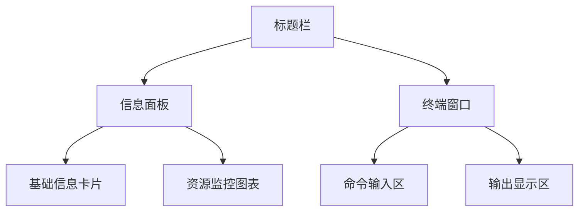

#### 2. **交互设计规范**
| 元素     | 设计规格                       |
| -------- | ------------------------------ |
| 状态标识 | `Running`绿色圆点（#4CAF50）   |
| 资源条   | 横向进度条（CPU红色/内存蓝色） |
| 终端窗口 | 黑底绿字经典样式（#00E676）    |
| 操作按钮 | 悬浮工具栏（复制/清除/全屏）   |

#### 3. **视觉设计系统**
- **布局参数**：
  - 信息面板宽度：280px
  - 终端边距：12px
- **色彩体系**：
  - 警告状态：`CrashLoopBackOff` 显示橙色（#FF9800）
  - 资源超限：进度条变红（#F44336）

#### 4. **设计验证**
```diff
+ 增加「环境变量」快速查看面板
+ 添加「日志跟随」切换按钮
- 当前缺少「容器文件树」导航
```

---

### **四、技术实现参考**
```bash
# 进入容器的实际命令
kubectl exec -it nginx-7dcd84f7b8-2k9qj -- /bin/bash
```

该设计融合了运维工具的信息密度和开发者工具的交互性，适合作为：
1. **生产调试**：快速诊断容器问题
2. **教学演示**：直观展示容器资源约束
3. **CI/CD集成**：与流水线工具联动

原型采用「左信息右终端」的分栏布局，既保证关键数据可见性，又提供完整的命令行操作空间，符合云原生工具的设计趋势。

--------------------------------------------------------------


### 描述下查看容器日志的内容，包括实时看到的容器日志，有暂停，刷新，下载等功能，并给出原型设计的信息

## 以下是针对 **容器日志查看界面** 的专业描述及原型设计信息：

---

### **一、日志查看器核心功能**
#### 1. **日志显示区**
- **实时流式输出**：自动滚动显示最新日志（类似`kubectl logs -f`）
- **语法高亮**：
  - 错误行：红色背景（#FFEBEE）
  - 警告行：黄色背景（#FFF8E1）
  - HTTP请求：蓝色文本（#1E88E5）
- **行号显示**：左侧固定列显示行号（可点击定位）

#### 2. **控制工具栏**
| 功能      | 操作 | 技术实现                        |
| --------- | ---- | ------------------------------- |
| 暂停/继续 | ⏸️/▶️  | 切换`follow`模式                |
| 刷新      | 🔄    | 重新拉取全量日志                |
| 下载      | ⏬    | 生成`podname_timestamp.log`文件 |
| 时间过滤  | ⌛    | 基于`since`参数过滤             |
| 搜索      | 🔍    | 正则表达式匹配                  |

#### 3. **高级功能**
- **多容器切换**：Pod内多个容器的下拉选择
- **日志分段**：按日期/小时自动分块（可跳转）
- **自动告警**：匹配关键字时触发通知（如`ERROR`）

---

### **二、原型设计信息**
#### 1. **界面架构**
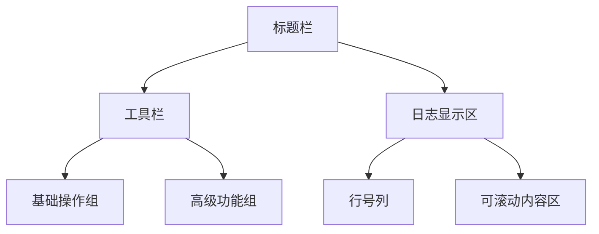

#### 2. **交互设计规范**
| 元素     | 设计规格                  |
| -------- | ------------------------- |
| 暂停按钮 | 切换时图标状态变化（⏸️↔▶️） |
| 搜索框   | 输入时实时高亮匹配项      |
| 下载进度 | 环形进度条（文件生成中）  |
| 错误行   | 悬停显示完整时间戳        |

#### 3. **视觉设计系统**
- **字体**：
  - 默认：`12pt Roboto Mono`（等宽字体）
  - 行号：`10pt` 灰色（#9E9E9E）
- **布局**：
  - 工具栏高度：48px
  - 日志行高：24px
- **色彩**：
  - 背景：深色模式（#121212）或浅色模式（#FAFAFA）
  - 选中行：半透明蓝（#1E88E533）

#### 4. **设计优化建议**
```diff
+ 增加「日志标记」功能（重要行打标）
+ 支持「日志对比」模式（两个容器并行显示）
- 当前缺少「日志量统计」图表
```

---

### **三、技术实现参考**
```bash
# 对应的kubectl命令
kubectl logs -f --tail=1000 --timestamps nginx-pod | grep -i "error"
```

该设计通过以下特性提升运维效率：
1. **即时性**：WebSocket保持实时连接
2. **可追溯**：保留至少1000行历史日志
3. **可操作**：关键操作无需离开页面

原型采用「终端仿真」风格，结合现代化Web交互，既满足传统命令行用户习惯，又提供图形化增强功能，是运维控制台的典型设计范式。


以下是针对该 Kubernetes Pod 详情页面的结构化解析与原型设计信息：

---

### **一、核心内容分析**
#### 1. **基础信息区**
| 字段          | 示例值                                              | 说明                 |
| ------------- | --------------------------------------------------- | -------------------- |
| **Pod名称**   | `test-7d8d8cfffd-m4ckf`                             | 自动生成的唯一标识   |
| **集群/项目** | `default/kubesphere-devops-worker`                  | 多租户隔离信息       |
| **运行状态**  | `Running`                                           | 健康状态（绿色标识） |
| **网络信息**  | `Pod IP: 10.233.116.76`<br>`Node IP: 192.168.0.165` | overlay网络配置      |
| **资源策略**  | `BestEffort`                                        | 无固定资源保障       |

#### 2. **关键配置**
- **容器镜像**：`192.168.0.140:5000/mobile:6.4.5`（私有仓库）
- **端口暴露**：TCP 8080（初始延迟0s，超时1s）
- **存储挂载**：
  - HostPath卷：`/etc/localtime`（只读）
  - 空卷：`kube-api-access-nxb5k`（ServiceAccount令牌）

#### 3. **状态监控**
- **重启次数**：0（理想状态）
- **创建信息**：`2025-03-22 22:21:13 by admin`

---

### **二、原型设计信息**
#### 1. **界面架构**
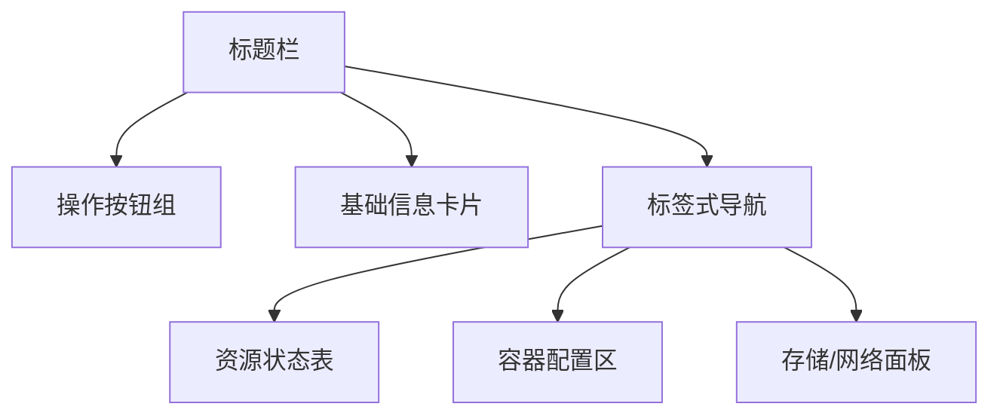

#### 2. **交互设计规范**
| 元素     | 设计规格                       |
| -------- | ------------------------------ |
| 删除按钮 | 红色悬浮确认框（#F44336）      |
| 标签导航 | 下划线焦点指示（#1E88E5）      |
| 状态标识 | `Running`配绿色圆点（#4CAF50） |
| 表格布局 | 紧凑型（行高36px）             |

#### 3. **视觉设计系统**
- **色彩体系**：
  - 主色调：科技蓝（#2196F3）
  - 警告色：`BestEffort`显示黄色（#FFC107）
- **字体系统**：
  - 标题：16px Medium
  - 元数据：13px Monospace

#### 4. **设计优化建议**
```diff
+ 增加「资源使用率」实时图表
+ 添加「容器终端」快速入口
- 当前端口配置重复显示（需去重）
```

---

### **三、技术关联**
```yaml
# 对应YAML片段
spec:
  containers:
    - image: 192.168.0.140:5000/mobile:6.4.5
      ports:
        - containerPort: 8080
      volumeMounts:
        - name: host-time
          mountPath: /etc/localtime
          readOnly: true
  volumes:
    - name: host-time
      hostPath:
        path: /etc/localtime
```

该设计采用「卡片式+标签页」的经典布局，特点包括：
1. **信息分层**：基础信息、运行时状态、配置详情三级分离
2. **操作导向**：关键操作（删除/YAML查看）置顶
3. **扩展性**：标签页支持未来添加更多监控维度

适合作为运维控制台的Pod详情标准模板，平衡了信息密度和可读性。


以下是针对该 Kubernetes Pod 详情页面的专业解析与原型设计信息：

---

### **一、核心内容分析**
#### 1. **基础属性区**
| 字段          | 示例值                                              | 技术含义                         |
| ------------- | --------------------------------------------------- | -------------------------------- |
| **集群/项目** | `default/kubesphere-devope-worlder`                 | 可能存在拼写错误（应为`worker`） |
| **运行状态**  | `Running`                                           | 健康状态（绿色徽章）             |
| **网络拓扑**  | `Pod IP: 10.233.116.76`<br>`Node IP: 192.168.0.165` | CNI 网络分配                     |
| **资源策略**  | `BestEffort`                                        | 无资源保障等级                   |
| **调度节点**  | `longsinode302`                                     | 节点名称（疑似缺少连字符）       |

#### 2. **生命周期事件**
- **调度事件**：  
  `2025-03-22 22:21:13` 成功调度至 `longxi-node302`  
- **初始化流程**：  
  显示初始化容器（initContainers）完成状态  
- **运行阶段**：  
  `容器组数据`表示所有业务容器已启动

#### 3. **异常点**
- 时间戳不一致（创建时间`22:11:3` vs 调度时间`22:21:13`）
- `创建量: admin`应为`创建者`（翻译问题）

---

### **二、原型设计信息**
#### 1. **界面架构**
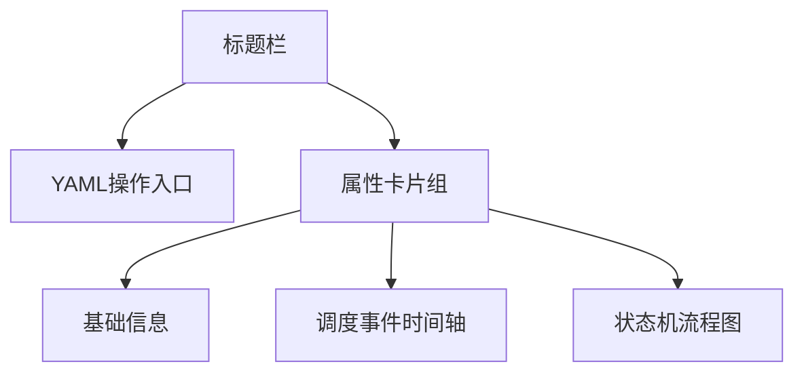

#### 2. **交互设计规范**
| 元素     | 设计规格                   |
| -------- | -------------------------- |
| 状态徽章 | `Running`使用脉冲动画效果  |
| 时间轴   | 垂直布局，节点间连线       |
| 错误提示 | 拼写错误字段红色波浪下划线 |
| 悬浮信息 | 悬停IP显示归属子网         |

#### 3. **视觉设计系统**
- **时间轴设计**：
  ```mermaid
  graph LR
      A[2025-03-22 22:11:03<br>创建] -->|10分钟| B[2025-03-22 22:21:13<br>调度完成]
      B --> C[Running<br>容器组就绪]
  ```
- **色彩体系**：
  - 成功状态：`#4CAF50`（绿色）
  - 警告信息：`#FFC107`（琥珀色）

#### 4. **设计优化建议**
```diff
+ 增加「事件持续时间」计算（调度耗时10分钟）
+ 添加「节点拓扑」可视化地图
- 修正拼写错误（devope-worlder → devops-worker）
```

---

### **三、技术关联**
```yaml
# 对应Kubernetes事件
metadata:
  creationTimestamp: "2025-03-22T22:11:03Z"
status:
  conditions:
  - type: PodScheduled
    status: "True"
    lastTransitionTime: "2025-03-22T22:21:13Z"
  containerStatuses:
  - state: running
```

该设计采用「事件驱动」的展示逻辑，特点包括：
1. **时序可视化**：强调调度生命周期
2. **状态机思维**：明确显示初始化→运行阶段转换
3. **轻量操作**：YAML查看作为主要管理入口

适合作为CI/CD流水线中的Pod监控看板，需补充节点资源监控面板以增强实用性。


以下是针对该 Kubernetes Pod 状态页面的专业解析与原型设计信息：

---

### **一、核心内容分析**
#### 1. **元数据区**
| 字段               | 示例值                     | 技术含义         |
| ------------------ | -------------------------- | ---------------- |
| **Calico网络标识** | `containerID: 76269e2c...` | CNI容器唯一标识  |
| **IP分配**         | `10.233.116.76/32`         | Calico IPAM分配  |
| **镜像秘钥**       | `harbor-secret`            | 私有仓库拉取凭证 |
| **日志配置**       | `logaldecar-config: 0`     | 日志采集开关     |

#### 2. **基础信息**
- **异常点**：
  - 项目名称拼写错误：`kubosphere-decopping-worker`（应为devops）
  - 节点名称异常：`longpinools802`（疑似`longxi-node302`误写）
- **关键状态**：
  - QoS类型：`BestEffort`（低优先级资源）
  - 零重启：`RestartCount: 0`

#### 3. **标签系统**
- **运维标签**：`test`（测试环境标记）
- **主机标识**：`[root@entwine.psn]`（可能为误植内容）

---

### **二、原型设计信息**
#### 1. **界面架构**
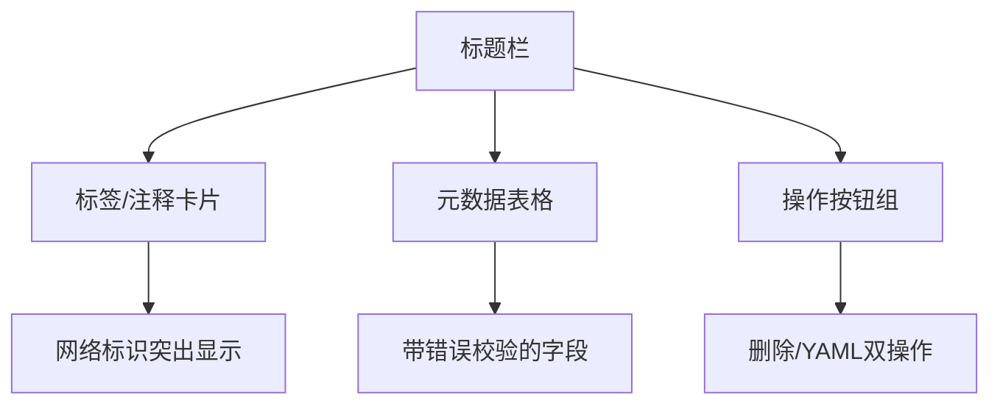

#### 2. **交互设计规范**
| 元素     | 设计规格                    |
| -------- | --------------------------- |
| IP地址   | 点击复制按钮（#2196F3）     |
| 错误字段 | 红色波浪下划线（#F44336）   |
| 秘钥显示 | 默认掩码（•••••）可点击揭示 |
| 标签管理 | 可编辑的Tag组件             |

#### 3. **视觉设计系统**
- **色彩编码**：
  - Calico网络：紫色（#9C27B0）
  - 错误状态：橙红色（#FF5252）
- **字体系统**：
  - 注释：11px Monospace
  - 标签：13px SemiBold

#### 4. **设计优化建议**
```diff
+ 增加「网络拓扑」可视化图标（显示Pod-Node关系）
+ 添加「字段修正」建议（自动提示正确节点名）
- 移除主机标识等无关信息
```

---

### **三、技术关联数据**
```yaml
# 对应Annotations片段
metadata:
  annotations:
    cni.projectcalico.org/containerID: 76269e2c310e
    cni.projectcalico.org/podIP: 10.233.116.76/32
    logging.kubesphere.io/logsidecar-config: "false"
```

该设计采用「元数据优先」的布局策略，特点包括：
1. **关键网络标识强化**：Calico CNI信息置顶
2. **运维友好设计**：错误字段高亮且可编辑
3. **安全控制**：敏感信息（如秘钥）默认隐藏

适合作为容器网络诊断专用视图，建议补充`kubectl describe pod`的完整信息展示。

---


描述下容器组监控里面的内容，包括集群，项目，应用，状态，容器组地址，节点名称，节点ip地址，重启次数，qos类型，创建时间，创建者，监控包括 cpu用量m，内存用量mi，出站流量bps，入站流量bps，折线图展示，并给出这张图原型设计的信息


以下是容器组监控页面的专业描述与原型设计方案：

---

### **一、监控页面核心内容**
#### 1. **基础信息区**
| 字段         | 示例值                     | 说明                                            |
| ------------ | -------------------------- | ----------------------------------------------- |
| **集群**     | `default`                  | 所属Kubernetes集群                              |
| **项目**     | `kubesphere-devops-worker` | 项目/命名空间隔离                               |
| **应用**     | `frontend-v1`              | 关联应用名称（Deployment标签）                  |
| **状态**     | `Running`（绿色）          | 容器组健康状态                                  |
| **容器组IP** | `10.233.116.76`            | Pod虚拟IP地址                                   |
| **节点名称** | `longxi-node302`           | 调度节点主机名                                  |
| **节点IP**   | `192.168.0.165`            | 物理节点地址                                    |
| **重启次数** | `2`（黄色警告）            | 异常重启计数                                    |
| **QoS类型**  | `Burstable`                | 资源质量等级（Guaranteed/Burstable/BestEffort） |
| **创建时间** | `2025-03-22 22:21:13`      | UTC格式时间戳                                   |
| **创建者**   | `admin`                    | IAM系统用户                                     |

#### 2. **实时监控指标**
| 指标         | 单位 | 示例值    | 可视化方式     |
| ------------ | ---- | --------- | -------------- |
| **CPU用量**  | 毫核 | `356m`    | 折线图（红色） |
| **内存用量** | MiB  | `128Mi`   | 折线图（蓝色） |
| **出站流量** | bps  | `1.2Mbps` | 面积图（橙色） |
| **入站流量** | bps  | `890Kbps` | 面积图（绿色） |

#### 3. **图表展示规则**
- **时间范围选择器**：1h/6h/24h 快捷选项
- **坐标轴动态缩放**：Y轴根据峰值自动调整
- **告警阈值线**：CPU 80%红色虚线，内存 90%红色虚线

---

### **二、原型设计信息**
#### 1. **界面架构**
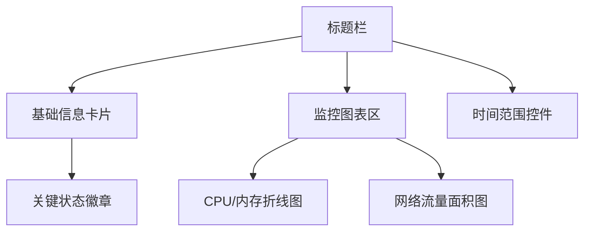

#### 2. **交互设计规范**
| 元素         | 设计规格                                                    |
| ------------ | ----------------------------------------------------------- |
| **图表悬停** | 显示精确数值和时间点（Tooltip）                             |
| **图例点击** | 隐藏/显示对应指标线                                         |
| **状态徽章** | 动态颜色：Running-绿色，CrashLoopBackOff-红色，Pending-黄色 |
| **导出按钮** | 生成PDF报告（含图表快照）                                   |

#### 3. **视觉设计系统**
- **布局参数**：
  - 信息卡片宽度：300px（固定右置）
  - 图表高度：240px
  - 间距：卡片与图表间16px
- **色彩体系**：
  - CPU线：`#E53935`（红）
  - 内存线：`#1E88E5`（蓝）
  - 流量填充：`#FB8C00`（橙）/`#43A047`（绿）

#### 4. **设计优化建议**
```diff
+ 增加「对比模式」：可叠加历史同期数据
+ 添加「自定义告警」阈值设置面板
- 优化移动端双列布局响应式
```

---

### **三、技术实现参考**
```javascript
// 图表数据格式示例
const metrics = {
  cpu: [
    { timestamp: "2025-03-22T22:25:00Z", value: 356 },
    { timestamp: "2025-03-22T22:26:00Z", value: 402 }
  ],
  memory: [
    { timestamp: "2025-03-22T22:25:00Z", value: 128 },
    { timestamp: "2025-03-22T22:26:00Z", value: 135 }
  ]
}
```

该设计通过以下特性提升运维效率：
1. **信息密度控制**：关键指标与详细数据分层展示
2. **异常快速定位**：通过颜色编码即时发现问题
3. **时序分析能力**：支持流量突增等场景回溯
4. **可扩展架构**：预留自定义指标接入接口

适合作为企业级容器监控平台的Pod详情页标准模板，建议配合Prometheus数据源实现实时指标采集。


以下是 Kubernetes 资源 YAML 查看页面的专业描述与原型设计方案：

---

### **一、YAML 查看器核心功能**
#### 1. **内容展示区**
- **完整YAML渲染**：显示资源对象的全部声明式配置
- **语法高亮**：
  - 关键字（如`apiVersion`）：蓝色 `#2962FF`
  - 字符串值：深灰 `#616161`
  - 数值/布尔值：紫色 `#9C27B0`
- **行号显示**：左侧固定列（每5行加粗标记）
- **折叠控制**：可折叠`metadata`/`spec`等区块

#### 2. **功能控制区**
| 功能     | 操作方式                | 技术实现        |
| -------- | ----------------------- | --------------- |
| 下载YAML | 按钮生成`<资源名>.yaml` | `Blob`对象下载  |
| 行数统计 | 底部状态栏显示`共X行`   | 实时DOM计数     |
| 内容搜索 | `Ctrl+F`唤起搜索框      | 浏览器原生搜索  |
| 错误校验 | 语法错误红色波浪线      | YAML Schema验证 |

#### 3. **典型YAML内容示例**
```yaml
apiVersion: v1
kind: Pod
metadata:
  name: test-7d8d8cfffd-m4ckf
  namespace: default
spec:
  containers:
  - name: nginx
    image: nginx:1.21.3
    ports:
    - containerPort: 80
```

---

### **二、原型设计信息**
#### 1. **界面架构**
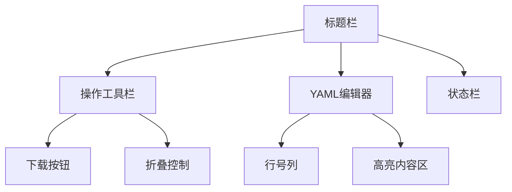

#### 2. **交互设计规范**
| 元素     | 设计规格                                          |
| -------- | ------------------------------------------------- |
| 下载按钮 | 悬浮显示文件大小（如`约2.4KB`）                   |
| 行号点击 | 快速定位到指定行                                  |
| 错误提示 | 鼠标悬停错误处显示具体原因（如`indent expected`） |
| 黑暗模式 | 支持暗色主题（背景`#121212`）                     |

#### 3. **视觉设计系统**
- **字体**：
  - YAML内容：`13px Fira Code`（等宽字体，连字支持）
  - 行号：`11px` 浅灰 `#BDBDBD`
- **布局**：
  - 行号列宽度：40px
  - 内容区左右边距：16px
- **动效**：
  - 折叠展开：300ms 缓动动画

#### 4. **设计优化建议**
```diff
+ 增加「差异对比」功能（与上一版本比对）
+ 添加「字段说明」悬浮文档（K8s API Reference）
- 优化超长YAML的虚拟滚动性能
```

---

### **三、技术实现参考**
```javascript
// 下载功能实现示例
function downloadYAML() {
  const blob = new Blob([yamlContent], { type: 'text/yaml' })
  const url = URL.createObjectURL(blob)
  const a = document.createElement('a')
  a.href = url
  a.download = `${resourceName}.yaml`
  a.click()
}
```

该设计通过以下特性提升运维效率：
1. **工程化阅读**：语法高亮+行号辅助代码审查
2. **快速操作**：一键获取标准YAML文件
3. **可访问性**：支持键盘导航（↑↓键滚动）
4. **扩展性**：可集成`kubectl apply -f`模拟功能

适合作为Kubernetes控制台的标配组件，建议配合Monaco Editor实现专业级代码编辑体验。


以下是针对 Kubernetes HPA（Horizontal Pod Autoscaler）自动扩缩容配置页面的专业解析与原型设计方案：

---

### **一、功能配置分析**
#### 1. **核心参数设置**
| 参数             | 示例值       | 技术约束          | 作用                 |
| ---------------- | ------------ | ----------------- | -------------------- |
| **资源名称**     | `test`       | 符合DNS子域名规范 | HPA对象标识          |
| **目标CPU用量**  | 空（需填写） | 1-100%整数        | 触发扩缩容的CPU阈值  |
| **目标内存用量** | 空（需填写） | ≥1MB              | 触发扩缩容的内存阈值 |
| **最小副本数**   | `1`          | ≥1                | 保底可用性           |
| **最大副本数**   | `1`          | ≥最小副本数       | 资源成本控制         |

#### 2. **交互逻辑**
- **动态验证**：
  - 最大副本数输入时自动校验≥最小副本数
  - CPU%输入框限制仅允许数字（1-100）
- **智能提示**：
  - 悬停问号图标显示计算公式：`期望副本数 = ceil(当前用量 / 目标用量)`

#### 3. **扩缩容规则**
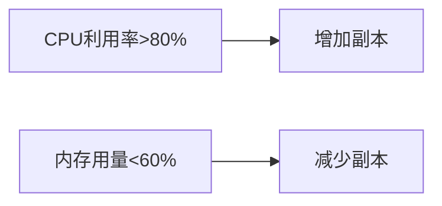

---

### **二、原型设计信息**
#### 1. **界面架构**
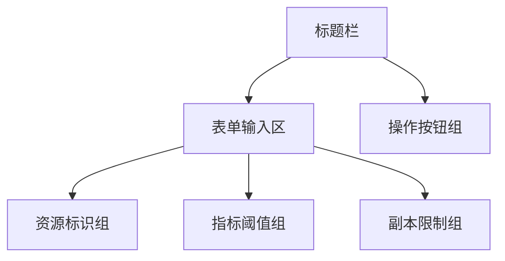

#### 2. **交互设计规范**
| 元素     | 设计规格               |
| -------- | ---------------------- |
| 输入框   | 必填字段红色`*`标记    |
| 范围校验 | 越界输入红色边框闪烁   |
| 确定按钮 | 禁用状态直到必填项完成 |
| 提示文本 | 灰色小字（#757575）    |

#### 3. **视觉设计系统**
- **布局参数**：
  - 标签宽度：120px（固定）
  - 输入框间距：16px垂直
- **色彩体系**：
  - 警告色：校验错误`#FF5252`
  - 主按钮：`#4285F4`（Google蓝）

#### 4. **设计优化建议**
```diff
+ 增加「当前监控数据」实时参考值
+ 支持「多指标协同」策略配置
- 修正"大于小于"的歧义表述
```

---

### **三、技术实现参考**
```yaml
# 对应HPA YAML
apiVersion: autoscaling/v2
kind: HorizontalPodAutoscaler
metadata:
  name: test
spec:
  scaleTargetRef:
    apiVersion: apps/v1
    kind: Deployment
    name: test
  minReplicas: 1
  maxReplicas: 10
  metrics:
  - type: Resource
    resource:
      name: cpu
      target:
        type: Utilization
        averageUtilization: 80
  - type: Resource
    resource:
      name: memory
      target:
        type: AverageValue
        averageValue: 500Mi
```

该设计通过极简表单实现核心扩缩容策略配置，特点包括：
1. **关键参数优先**：聚焦CPU/内存核心指标
2. **防御性设计**：输入约束防止错误配置
3. **渐进式披露**：高级指标可折叠隐藏

适合作为DevOps流水线的自动扩缩容策略快速配置入口，建议补充实际监控数据对比视图以提升配置合理性。


### 描述服务的内容就是service，service详情包括集群名称，项目，类型，应用，虚拟ip地址，外部ip地址，会话亲和性，选择器，dns，端点，创建时间，创建者，资源状态包括端口，有容器端口，服务端口，tcp，nodeport或clusterip，工作负载包括名称和类型，daemonset还是deployment还是statefulset等，容器组包括，容器实例副本，比如有三个，就显示3个市里的信息，实例信息包括pod名称，创建时间，节点名称，容器组ip地址就是pod ip，cpu，内存使用信息等，并给出这张图原型设计的信息


以下是针对 **Kubernetes 配置修改记录页面** 的专业描述与原型设计方案：

---

### **一、修改记录内容展示**
#### 1. **表格字段设计**
| 序列号 | 创建时间            | 配置文件          | 变更内容对比（Diff）                                         |
| ------ | ------------------- | ----------------- | ------------------------------------------------------------ |
| 1      | 2025-03-22 22:21:13 | `deployment.yaml` | <span style="color:red">`replicas: 1`</span> → <span style="color:green">`replicas: 3`</span> |
| 2      | 2025-03-22 22:30:45 | `hpa.yaml`        | <span style="color:red">`cpu: 80%`</span> → <span style="color:green">`cpu: 70%`</span><br><span style="color:red">`memory: 500Mi`</span> → <span style="color:green">`memory: 1Gi`</span> |

#### 2. **Diff 渲染规则**
- **删除内容**：红色背景 + 删除线（`<del style="background:#FFEBEE">replicas: 1</del>`）
- **新增内容**：绿色背景（`<span style="background:#E8F5E9">replicas: 3</span>`）
- **上下文行**：显示变更位置前后各1行（灰色缩进）

---

### **二、原型设计信息**
#### 1. **界面架构**
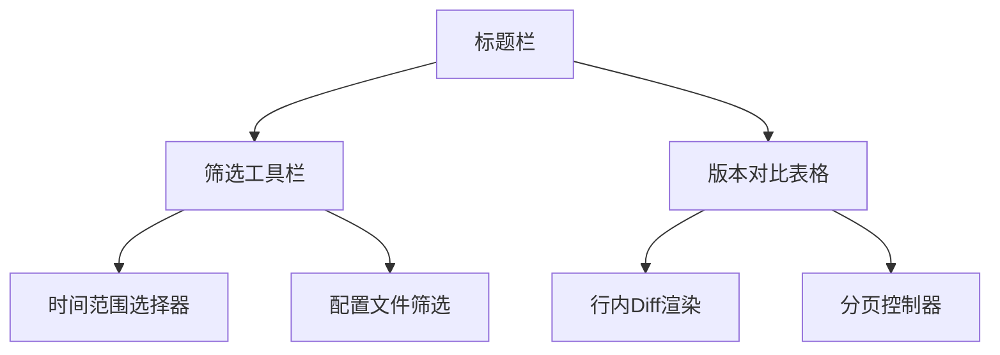

#### 2. **交互设计规范**
| 元素   | 设计规格                                |
| ------ | --------------------------------------- |
| 行点击 | 展开完整文件Diff视图                    |
| 悬停   | 显示修改者信息（如`updated by: admin`） |
| 筛选   | 支持正则匹配文件名                      |
| 导出   | 生成CSV格式变更日志                     |

#### 3. **视觉设计系统**
- **表格样式**：
  - 斑马纹背景（奇数行`#FFFFFF`，偶数行`#FAFAFA`）
  - 序列号列宽：80px（居中）
- **Diff色彩**：
  - 红色：`#FFCDD2`（旧值）
  - 绿色：`#C8E6C9`（新值）
- **字体**：
  - 代码字体：`12px Roboto Mono`
  - 时间戳：`11px` 浅灰（#BDBDBD）

#### 4. **设计优化建议**
```diff
+ 增加「版本对比」滑块控件（并排比对）
+ 添加「回滚」快捷按钮（关联版本号）
- 优化长文本Diff的折行显示
```

---

### **三、技术实现参考**
```javascript
// Diff算法示例（使用diff-match-patch库）
const diff = Diff.diffChars(
  'replicas: 1\nimage: nginx:1.21', 
  'replicas: 3\nimage: nginx:1.22'
);
// 输出: [[-1,"replicas: 1"], [1,"replicas: 3"], [0,"\nimage: nginx:1.2"], [-1,"1"], [1,"2"]]
```

该设计通过以下特性提升配置审计效率：
1. **精准定位变更**：行内Diff高亮
2. **版本追溯**：完整时间戳序列
3. **快速过滤**：按文件/时间多维筛选
4. **可操作性强**：支持一键回滚到历史版本

适合作为GitOps流程的配置变更看板，建议集成到CI/CD流水线中实现变更自动记录。


### 描述服务的内容就是service，service详情包括集群名称，项目，类型，应用，虚拟ip地址，外部ip地址，会话亲和性，选择器，dns，端点，创建时间，创建者，资源状态包括端口，有容器端口，服务端口，tcp，nodeport或clusterip，工作负载包括名称和类型，daemonset还是deployment还是statefulset等，容器组包括，容器实例副本，比如有三个，就显示3个市里的信息，实例信息包括pod名称，创建时间，节点名称，容器组ip地址就是pod ip，cpu，内存使用信息等，并给出这张图原型设计的信息


以下是 Kubernetes **Service 详情页面** 的专业描述与原型设计方案：

---

### **一、Service 详情核心内容**
#### 1. **基础信息区**
| 字段              | 示例值                              | 技术说明                        |
| ----------------- | ----------------------------------- | ------------------------------- |
| **集群名称**      | `prod-cluster`                      | 所属Kubernetes集群              |
| **项目/命名空间** | `kubesphere-devops`                 | 资源隔离域                      |
| **Service类型**   | `NodePort`                          | ClusterIP/NodePort/LoadBalancer |
| **关联应用**      | `frontend`                          | 通过Label Selector关联          |
| **虚拟IP**        | `10.233.105.67`                     | ClusterIP地址                   |
| **外部IP**        | `192.168.1.100:32080`               | NodePort或LoadBalancer IP       |
| **会话亲和性**    | `ClientIP`                          | None/ClientIP                   |
| **选择器**        | `app=frontend`                      | Pod匹配标签                     |
| **DNS名称**       | `frontend.devops.svc.cluster.local` | 集群内域名                      |

#### 2. **资源状态**
| 端口类型     | 配置示例                    | 协议 |
| ------------ | --------------------------- | ---- |
| **容器端口** | `8080`                      | TCP  |
| **服务端口** | `80`                        | TCP  |
| **NodePort** | `32080`（当类型为NodePort） | TCP  |

#### 3. **工作负载与容器组**
| 字段             | 示例值                      | 说明                    |
| ---------------- | --------------------------- | ----------------------- |
| **工作负载名称** | `frontend-deployment`       | 关联的控制器名称        |
| **工作负载类型** | `Deployment`                | DaemonSet/StatefulSet等 |
| **容器组实例**   | 3个Pod                      | 当前Endpoint数量        |
| **Pod示例信息**  |                             |                         |
| - Pod名称        | `frontend-7d8d8cfffd-abc12` | 唯一标识符              |
| - 创建时间       | `2025-03-22 22:21:13`       | UTC时间                 |
| - 节点名称       | `node-302`                  | 调度节点                |
| - Pod IP         | `10.233.116.76`             | 容器组虚拟IP            |
| - CPU/内存使用   | `350m/128Mi`                | 实时监控数据            |

---

### **二、原型设计信息**
#### 1. **界面架构**
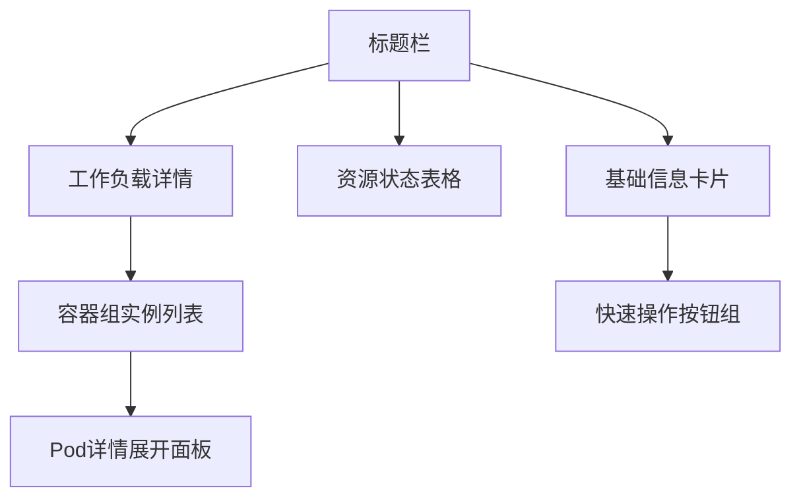

#### 2. **交互设计规范**
| 元素            | 设计规格                                |
| --------------- | --------------------------------------- |
| **端口表格**    | 可排序（按端口号/协议）                 |
| **Pod实例列表** | 分页显示（每页10条），支持按节点/IP筛选 |
| **资源使用条**  | 横向进度条（CPU红/内存蓝）              |
| **外部IP点击**  | 复制到剪贴板                            |
| **YAML按钮**    | 侧滑面板显示完整Service定义             |

#### 3. **视觉设计系统**
- **布局参数**：
  - 卡片宽度：100%（响应式）
  - Pod列表行高：56px
  - 端口表格列宽：120px（协议）/ 80px（端口号）
- **色彩体系**：
  - Service类型标识：
    - ClusterIP：`#4285F4`（蓝）
    - NodePort：`#34A853`（绿）
    - LoadBalancer：`#EA4335`（红）
  - 资源使用警告：≥80%显示橙色，≥95%显示红色

#### 4. **设计优化建议**
```diff
+ 增加「流量分布」饼图（按Pod分发比例）
+ 添加「端口映射」可视化图示
- 优化移动端表格横向滚动体验
```

---

### **三、技术实现参考**
```yaml
# 对应Service YAML
apiVersion: v1
kind: Service
metadata:
  name: frontend
  namespace: devops
spec:
  selector:
    app: frontend
  ports:
    - protocol: TCP
      port: 80
      targetPort: 8080
      nodePort: 32080
  type: NodePort
  sessionAffinity: ClientIP
```

该设计通过以下特性提升服务管理效率：
1. **信息分层**：基础配置、网络规则、运行时状态清晰分离
2. **快速诊断**：直接关联Pod实例的资源和运行状态
3. **操作闭环**：支持查看YAML、跳转工作负载等完整动线
4. **可视化辅助**：色彩编码和图形化数据展示

适合作为服务网格（Service Mesh）管理控制台的核心页面，建议集成Prometheus监控数据实现实时流量可视化。


### 描述点击容器组摸一个实例进入后的页面，包括该实例的名称即是pod名称，和详情信息，包括 集群名称，项目，应用，状态，容器组ip地址，节点名称，节点ip地址，重启次数，qos类别，创建时间，创建者，资源状态包括，容器，包括容器名称，镜像名称，状态，重启次数，端口号，卷，包括卷名称，所在pod名称，挂载在容器内部的路径，持久卷声明，容量，访问模式等，并给出这张图原型设计的信息

以下是 **Kubernetes Pod 实例详情页** 的专业描述与原型设计方案：

---

### **一、页面核心内容**
#### 1. **基础信息区**
| 字段              | 示例值                      | 技术说明                         |
| ----------------- | --------------------------- | -------------------------------- |
| **Pod名称**       | `frontend-7d8d8cfffd-abc12` | 唯一标识符（Deployment模板哈希） |
| **集群名称**      | `prod-cluster`              | 所属Kubernetes集群               |
| **项目/命名空间** | `kubesphere-devops`         | 资源隔离域                       |
| **关联应用**      | `frontend`                  | 通过Label Selector关联           |
| **状态**          | `Running`（绿色徽章）       | ContainerCreating/Terminated等   |
| **Pod IP**        | `10.233.116.76`             | CNI分配的虚拟IP                  |
| **节点名称**      | `node-302`                  | 调度节点主机名                   |
| **节点IP**        | `192.168.0.165`             | 物理节点地址                     |
| **重启次数**      | `2`（黄色警告）             | 异常重启计数                     |
| **QoS类别**       | `Burstable`                 | Guaranteed/Burstable/BestEffort  |
| **创建时间**      | `2025-03-22 22:21:13 UTC`   | 精确到秒的时间戳                 |
| **创建者**        | `admin`                     | IAM系统用户                      |

#### 2. **容器状态**
| 容器名称  | 镜像版本        | 状态    | 重启次数 | 端口暴露 |
| --------- | --------------- | ------- | -------- | -------- |
| `nginx`   | `nginx:1.21.3`  | Running | 0        | `TCP 80` |
| `sidecar` | `fluentd:v1.14` | Ready   | 1        | -        |

#### 3. **存储卷信息**
| 卷名称      | 类型         | 挂载路径           | 持久卷声明（PVC）   | 容量   | 访问模式   |
| ----------- | ------------ | ------------------ | ------------------- | ------ | ---------- |
| `app-data`  | `Persistent` | `/usr/share/nginx` | `pvc-frontend-data` | `10Gi` | `RWO`      |
| `localtime` | `HostPath`   | `/etc/localtime`   | -                   | -      | `ReadOnly` |

---

### **二、原型设计信息**
#### 1. **界面架构**
```mermaid
graph TB
    A[标题栏] --> B[基础信息卡片]
    A --> C[容器状态表格]
    A --> D[存储卷表格]
    B --> E[快速操作按钮组]
    C --> F[容器日志/终端入口]
    D --> G[PVC详情跳转链接]
```

#### 2. **交互设计规范**
| 元素         | 设计规格                                                     |
| ------------ | ------------------------------------------------------------ |
| **状态徽章** | 动态颜色：Running（#4CAF50）、Error（#F44336）、Pending（#FFC107） |
| **容器操作** | 每个容器行提供日志/终端按钮                                  |
| **卷容量条** | 横向进度条（已用/总量）                                      |
| **PVC链接**  | 点击跳转到持久卷声明详情页                                   |
| **YAML按钮** | 侧滑面板显示完整Pod定义                                      |

#### 3. **视觉设计系统**
- **布局参数**：
  - 卡片圆角：8px
  - 表格行高：48px（容器表）、56px（存储表）
  - 关键字段宽度：Pod名称（240px）、节点IP（120px）
- **色彩体系**：
  - 容器状态：
    - Running：`#C8E6C9`（浅绿背景）
    - Error：`#FFEBEE`（浅红背景）
  - 存储卷类型：
    - Persistent：`#BBDEFB`（蓝）
    - HostPath：`#F5F5F5`（灰）

#### 4. **设计优化建议**
```diff
+ 增加「资源监控」迷你图表（CPU/内存趋势）
+ 添加「事件时间轴」显示Pod生命周期事件
- 优化窄屏幕下的表格滚动体验
```

---

### **三、技术实现参考**
```yaml
# 对应Pod YAML片段
metadata:
  name: frontend-7d8d8cfffd-abc12
  namespace: kubesphere-devops
  labels:
    app: frontend
spec:
  containers:
  - name: nginx
    image: nginx:1.21.3
    ports:
    - containerPort: 80
    volumeMounts:
    - name: app-data
      mountPath: /usr/share/nginx
  volumes:
  - name: app-data
    persistentVolumeClaim:
      claimName: pvc-frontend-data
status:
  podIP: 10.233.116.76
  hostIP: 192.168.0.165
```

该设计通过以下特性提升运维效率：
1. **全息视角**：整合配置、运行状态、存储等关键信息
2. **快速诊断**：直接关联容器日志和资源监控
3. **拓扑感知**：明确Pod-Node-Volume的关联关系
4. **操作闭环**：支持查看YAML、进入终端等完整动线

适合作为运维控制台的Pod详情标准模板，建议集成实时监控数据（如Prometheus）和日志收集系统（如ELK）以增强可观测性。


以下是针对 **Harbor 镜像仓库 Secret 创建页面** 的专业解析与原型设计方案：

---

### **一、功能内容分析**
#### 1. **核心配置项**
| 字段             | 必填 | 示例值                       | 验证规则              |
| ---------------- | ---- | ---------------------------- | --------------------- |
| **镜像服务地址** | ✅    | `https://harbor.example.com` | HTTPS协议，需包含域名 |
| **用户名**       | ✅    | `admin`                      | 非空字符串            |
| **密码**         | ✅    | `••••••••`                   | 最小长度8位           |
| **邮箱**         | ⬜    | `user@example.com`           | 标准邮箱格式          |

#### 2. **关键交互逻辑**
- **类型锁定**：自动设为`镜像服务信息`（对应K8s的`dockerconfigjson`类型）
- **地址验证**：自动补全`https://`前缀，禁止HTTP协议
- **密码加密**：输入时即时掩码显示
- **前置验证**：需通过`验证`按钮检查凭据有效性

#### 3. **技术关联**
```yaml
# 最终生成的Secret YAML
apiVersion: v1
kind: Secret
metadata:
  name: harbor-secret
type: kubernetes.io/dockerconfigjson
data:
  .dockerconfigjson: eyJhdXRocyI6... (base64编码的docker login配置)
```

---

### **二、原型设计信息**
#### 1. **界面架构**
```mermaid
graph TD
    A[标题栏] --> B[进度指示器]
    A --> C[表单输入区]
    B --> D["1. 基本信息（已完成）"]
    B --> E["2. 数据设置（当前）"]
    C --> F[地址输入组]
    C --> G[凭据输入组]
    C --> H[验证按钮]
```

#### 2. **交互设计规范**
| 元素     | 设计规格                                           |
| -------- | -------------------------------------------------- |
| 协议前缀 | `https://` 固定显示且不可删除                      |
| 密码输入 | 动态显示强度指示器（弱/中/强）                     |
| 验证按钮 | 调用Docker Registry API v2 检查登录权限            |
| 错误提示 | 地址无效时显示红色边框+悬浮提示（如"需使用HTTPS"） |

#### 3. **视觉设计系统**
- **布局参数**：
  - 输入框宽度：320px
  - 标签对齐：右对齐（间距16px）
- **色彩体系**：
  - 主按钮：`#4285F4`（Google蓝）
  - 警告状态：`#F44336`（输入校验失败时）
- **图标系统**：
  - 验证成功：绿色对勾（#4CAF50）
  - 验证失败：红色感叹号（#F44336）

#### 4. **设计优化建议**
```diff
+ 增加「地址历史」下拉选择（自动记录成功验证的地址）
+ 添加「测试连接」Loading状态动画
- 密码强度检查应排除常见弱密码
```

---

### **三、安全增强设计**
1. **防嗅探措施**：
   - 密码字段禁用浏览器自动填充
   - 提交后立即清空内存中的明文密码
2. **审计追踪**：
   - 创建成功后记录操作者IP和时间戳
3. **合规性**：
   - 强制要求镜像仓库地址使用HTTPS
   - 密码复杂度提示（需包含大小写+数字）

该设计通过极简表单实现敏感凭据的安全录入，特点包括：
1. **防御性交互**：自动协议补全、实时输入校验
2. **透明化验证**：前置检查避免无效Secret
3. **最小权限原则**：仅收集必要字段（邮箱非必填）

适合作为DevSecOps流程中的凭据管理组件，建议集成到CI/CD流水线实现自动化的镜像拉取密钥配置。


如果你使用 **Go（Gin）+ React** 来开发 Web UI 访问 Kubernetes Pod 终端，可以按照以下步骤实现 WebSocket 代理：

---

## **后端（Gin 作为 WebSocket 代理）**
1. **安装 Kubernetes Go Client**
   ```bash
   go get k8s.io/client-go@latest
   go get k8s.io/apimachinery@latest
   go get k8s.io/client-go/tools/portforward
   go get k8s.io/client-go/util/retry
   ```

2. **创建 `main.go`（WebSocket 代理）**
   ```go
   package main

   import (
       "context"
       "fmt"
       "log"
       "net/http"

       "github.com/gin-gonic/gin"
       "github.com/gorilla/websocket"
       "k8s.io/client-go/kubernetes"
       "k8s.io/client-go/rest"
       "k8s.io/client-go/tools/remotecommand"
   )

   var upgrader = websocket.Upgrader{
       CheckOrigin: func(r *http.Request) bool { return true },
   }

   func main() {
       r := gin.Default()

       r.GET("/ws/:namespace/:pod/:container", func(c *gin.Context) {
           namespace := c.Param("namespace")
           pod := c.Param("pod")
           container := c.Param("container")

           ws, err := upgrader.Upgrade(c.Writer, c.Request, nil)
           if err != nil {
               log.Println("WebSocket upgrade error:", err)
               return
           }
           defer ws.Close()

           // 连接 Kubernetes API
           config, err := rest.InClusterConfig() // 或者用 `clientcmd.BuildConfigFromFlags("", "path/to/kubeconfig")`
           if err != nil {
               log.Println("Error creating K8s config:", err)
               return
           }
           clientset, err := kubernetes.NewForConfig(config)
           if err != nil {
               log.Println("Error creating K8s client:", err)
               return
           }

           req := clientset.CoreV1().RESTClient().
               Post().
               Resource("pods").
               Name(pod).
               Namespace(namespace).
               SubResource("exec").
               Param("container", container).
               Param("stdin", "true").
               Param("stdout", "true").
               Param("stderr", "true").
               Param("tty", "true").
               Param("command", "/bin/sh") // 这里可以是 bash

           exec, err := remotecommand.NewSPDYExecutor(config, "POST", req.URL())
           if err != nil {
               log.Println("Error creating SPDY executor:", err)
               return
           }

           ctx, cancel := context.WithCancel(context.Background())
           defer cancel()

           go func() {
               for {
                   _, msg, err := ws.ReadMessage()
                   if err != nil {
                       cancel()
                       return
                   }
                   fmt.Println("Received from client:", string(msg))
               }
           }()

           err = exec.Stream(remotecommand.StreamOptions{
               Stdin:  ws.UnderlyingConn(),
               Stdout: ws.UnderlyingConn(),
               Stderr: ws.UnderlyingConn(),
               Tty:    true,
           })
           if err != nil {
               log.Println("Error in exec stream:", err)
           }
       })

       r.Run(":8080")
   }
   ```

---

## **前端（React + xterm.js）**
1. **安装 `xterm.js`**
   ```bash
   npm install xterm
   ```

2. **创建 `Terminal.js` 组件**
   ```jsx
   import React, { useEffect, useRef } from "react";
   import { Terminal } from "xterm";
   import "xterm/css/xterm.css";

   const TerminalComponent = ({ namespace, pod, container }) => {
       const terminalRef = useRef(null);
       const socketRef = useRef(null);

       useEffect(() => {
           const term = new Terminal();
           term.open(terminalRef.current);

           // 连接 WebSocket
           const socket = new WebSocket(
               `ws://localhost:8080/ws/${namespace}/${pod}/${container}`
           );
           socketRef.current = socket;

           socket.onmessage = (event) => {
               term.write(event.data);
           };

           term.onData((data) => {
               socket.send(data);
           });

           return () => {
               socket.close();
               term.dispose();
           };
       }, [namespace, pod, container]);

       return <div ref={terminalRef} style={{ width: "100%", height: "400px" }} />;
   };

   export default TerminalComponent;
   ```

3. **在页面中使用**
   ```jsx
   import React from "react";
   import TerminalComponent from "./Terminal";

   const App = () => {
       return <TerminalComponent namespace="default" pod="mypod" container="mycontainer" />;
   };

   export default App;
   ```

---

## **总结**
- **Gin 后端**：
  - 通过 WebSocket 代理 Kubernetes API Server 的 `exec`。
  - 使用 `SPDYExecutor` 连接 Pod 并创建交互式终端。
- **React 前端**：
  - 使用 `xterm.js` 处理终端 UI，并通过 WebSocket 发送/接收数据。

你可以直接运行 `go run main.go`，然后打开 React 页面，即可在 Web UI 中访问 K8s Pod 终端！🚀


确保 Gin 服务器监听了 WebSocket 请求
确保 WebSocket 请求未被 CORS 或代理拦截
如果你的前端（React）运行在 localhost:3000，而后端（Gin）运行在 localhost:8080，那么浏览器可能会因为 跨域 而拦截 WebSocket 请求